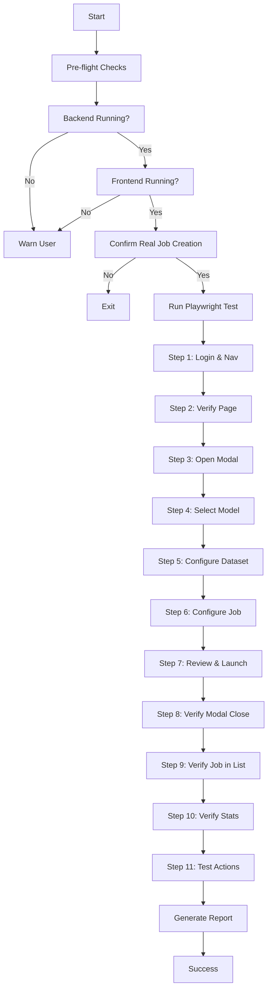

# Fine-Tuning Vibe Test - File Reference

This document lists all files created for the Fine-Tuning vibe test with absolute paths.

## Created Files

### 1. Main Test File (Playwright)
**Absolute Path**: `/home/ubuntu/dumont-cloud/tests/vibe/finetune-journey-vibe.spec.js`

**Size**: 650+ lines of JavaScript
**Test Count**: 3 scenarios
- Complete job creation journey (11 steps)
- Empty jobs state handling
- Filter tabs navigation

**Key Features**:
- REAL environment testing (no mocks)
- Captures performance metrics for each step
- Creates actual fine-tuning job on GCP via SkyPilot
- Tests Phi-3 Mini model (smallest, 8GB VRAM)
- Uses HuggingFace Alpaca dataset
- Validates entire 4-step wizard flow

**Run Command**:
```bash
npx playwright test /home/ubuntu/dumont-cloud/tests/vibe/finetune-journey-vibe.spec.js --project=chromium
```

---

### 2. Quick Start Guide (Documentation)
**Absolute Path**: `/home/ubuntu/dumont-cloud/tests/vibe/FINETUNE_TEST_GUIDE.md`

**Contents**:
- Prerequisites and setup
- Quick start instructions
- Expected output examples
- Debugging techniques
- Common issues and solutions
- Cleanup procedures
- Cost estimates

**View**:
```bash
cat /home/ubuntu/dumont-cloud/tests/vibe/FINETUNE_TEST_GUIDE.md
```

---

### 3. Test Runner Script (Bash)
**Absolute Path**: `/home/ubuntu/dumont-cloud/run-finetune-vibe-test.sh`

**Features**:
- Pre-flight checks (backend, frontend)
- Multiple execution modes
- Safety confirmation
- Colored terminal output
- Post-test guidance

**Permissions**: Executable (`chmod +x`)

**Run**:
```bash
/home/ubuntu/dumont-cloud/run-finetune-vibe-test.sh           # Normal
/home/ubuntu/dumont-cloud/run-finetune-vibe-test.sh --headed  # Visible
/home/ubuntu/dumont-cloud/run-finetune-vibe-test.sh --ui      # Interactive
/home/ubuntu/dumont-cloud/run-finetune-vibe-test.sh --debug   # Step-by-step
```

---

### 4. Implementation Summary
**Absolute Path**: `/home/ubuntu/dumont-cloud/FINETUNE_VIBE_TEST_SUMMARY.md`

**Contents**:
- Overview of what was created
- Technical details
- Integration points
- Success criteria
- Future enhancements

---

### 5. This File (File Reference)
**Absolute Path**: `/home/ubuntu/dumont-cloud/FINETUNE_TEST_FILES.md`

---

## Updated Files

### 1. Vibe Tests README
**Absolute Path**: `/home/ubuntu/dumont-cloud/tests/vibe/README.md`

**Changes**:
- Added Fine-Tuning test section
- Updated directory structure
- New execution examples
- Future test ideas

---

## Related Files (Pre-existing)

### Frontend Components
1. **FineTuning Page**: `/home/ubuntu/dumont-cloud/web/src/pages/FineTuning.jsx`
2. **FineTuningModal**: `/home/ubuntu/dumont-cloud/web/src/components/FineTuningModal.jsx`

### Backend API
1. **Fine-Tune Endpoints**: `/home/ubuntu/dumont-cloud/src/api/v1/endpoints/finetune.py`
2. **Fine-Tune Service**: `/home/ubuntu/dumont-cloud/src/domain/services/finetune_service.py`
3. **SkyPilot Provider**: `/home/ubuntu/dumont-cloud/src/infrastructure/providers/skypilot_provider.py`

### Test Infrastructure
1. **Playwright Config**: `/home/ubuntu/dumont-cloud/playwright.config.js`
2. **Auth Setup**: `/home/ubuntu/dumont-cloud/tests/e2e-journeys/auth.setup.js`
3. **Auth State**: `/home/ubuntu/dumont-cloud/tests/.auth/user.json`

---

## Directory Structure

```
/home/ubuntu/dumont-cloud/
│
├── tests/
│   ├── vibe/                                      # VIBE TESTS
│   │   ├── finetune-journey-vibe.spec.js          # NEW: Fine-Tuning test
│   │   ├── failover-journey-vibe.spec.js          # Existing: Failover test
│   │   ├── FINETUNE_TEST_GUIDE.md                 # NEW: Quick start guide
│   │   └── README.md                              # UPDATED
│   │
│   ├── e2e-journeys/                              # E2E TESTS
│   │   ├── auth.setup.js
│   │   ├── cpu-standby-failover.spec.js
│   │   └── REAL-user-actions.spec.js
│   │
│   └── .auth/
│       └── user.json                              # Auth state
│
├── web/
│   └── src/
│       ├── pages/
│       │   └── FineTuning.jsx                     # Fine-Tuning page
│       └── components/
│           └── FineTuningModal.jsx                # 4-step wizard
│
├── src/
│   ├── api/v1/endpoints/
│   │   └── finetune.py                            # API endpoints
│   ├── domain/services/
│   │   └── finetune_service.py                    # Business logic
│   └── infrastructure/providers/
│       └── skypilot_provider.py                   # SkyPilot integration
│
├── run-finetune-vibe-test.sh                      # NEW: Test runner
├── FINETUNE_VIBE_TEST_SUMMARY.md                  # NEW: Summary doc
├── FINETUNE_TEST_FILES.md                         # NEW: This file
└── playwright.config.js                           # Playwright config
```

---

## Quick Commands

### Run the Test
```bash
# Using the runner script (recommended)
cd /home/ubuntu/dumont-cloud
./run-finetune-vibe-test.sh

# Using Playwright directly
cd /home/ubuntu/dumont-cloud
npx playwright test tests/vibe/finetune-journey-vibe.spec.js --project=chromium
```

### View Documentation
```bash
# Quick start guide
less /home/ubuntu/dumont-cloud/tests/vibe/FINETUNE_TEST_GUIDE.md

# Implementation summary
less /home/ubuntu/dumont-cloud/FINETUNE_VIBE_TEST_SUMMARY.md

# Main vibe tests README
less /home/ubuntu/dumont-cloud/tests/vibe/README.md
```

### View Test Results
```bash
# List test results
ls -la /home/ubuntu/dumont-cloud/test-results/

# View HTML report
npx playwright show-report
```

---

## Test Execution Flow



---

## Environment Requirements

### System
- OS: Linux (Ubuntu 20.04+) or macOS
- Node.js: 16.x or higher
- npm: 7.x or higher
- Python: 3.9+ (for backend)

### Playwright
```bash
npm install
npx playwright install chromium
```

### Backend Services
- Flask API running on http://localhost:5000
- SkyPilot configured for GCP
- GCP credentials set up

### Frontend
- Vite dev server on http://localhost:5173
- React 18+
- Tailwind CSS

---

## Test Data

### Model
```javascript
{
  id: 'unsloth/Phi-3-mini-4k-instruct-bnb-4bit',
  name: 'Phi-3 Mini',
  vram: '8GB',
  params: '3.8B'
}
```

### Dataset
```javascript
{
  source: 'url',
  path: 'https://huggingface.co/datasets/yahma/alpaca-cleaned/resolve/main/alpaca_data_cleaned.json',
  format: 'alpaca'
}
```

### GPU
```javascript
{
  type: 'A100',
  vram: '40GB',
  cost: '~$1.50/hr'
}
```

### Configuration
```javascript
{
  lora_rank: 16,
  lora_alpha: 16,
  learning_rate: 0.0002,
  epochs: 1,
  batch_size: 2,
  max_seq_length: 2048
}
```

---

## Success Metrics

### Performance
- **Login & Nav**: < 2s
- **Page Load**: < 1s
- **Modal Open**: < 500ms
- **Step Navigation**: < 300ms each
- **API Response**: < 3s
- **Total Journey**: < 30s

### Validation
- ✅ All UI elements visible
- ✅ All buttons clickable
- ✅ All inputs functional
- ✅ Modal wizard navigable
- ✅ Job created successfully
- ✅ Dashboard updated
- ✅ Actions work (Refresh, Logs)

---

## CI/CD Integration

### GitHub Actions Example
```yaml
name: Vibe Tests

on: [push, pull_request]

jobs:
  vibe-test-finetune:
    runs-on: ubuntu-latest
    steps:
      - uses: actions/checkout@v3
      - uses: actions/setup-node@v3
        with:
          node-version: 18
      - name: Install dependencies
        run: npm install
      - name: Install Playwright
        run: npx playwright install chromium
      - name: Start backend
        run: python src/main.py &
      - name: Start frontend
        run: cd web && npm run dev &
      - name: Run Fine-Tuning vibe test
        run: npx playwright test tests/vibe/finetune-journey-vibe.spec.js
      - uses: actions/upload-artifact@v3
        if: always()
        with:
          name: playwright-report
          path: playwright-report/
```

---

## Troubleshooting

### Test Fails at Step 3 (Modal doesn't open)
```bash
# Check if button exists
npx playwright test tests/vibe/finetune-journey-vibe.spec.js --headed

# Debug with inspector
npx playwright test tests/vibe/finetune-journey-vibe.spec.js --debug
```

### Job Not Created (Step 9 fails)
```bash
# Check backend logs
tail -f /var/log/dumont-backend.log

# Check API manually
curl -H "Authorization: Bearer $TOKEN" http://localhost:5000/api/finetune/jobs
```

### Authentication Issues
```bash
# Re-run auth setup
npx playwright test tests/e2e-journeys/auth.setup.js

# Check auth state
cat /home/ubuntu/dumont-cloud/tests/.auth/user.json
```

---

## Contact

- **Repository**: github.com/dumont-cloud
- **Issues**: github.com/dumont-cloud/issues
- **Email**: support@dumontcloud.com
- **Slack**: #vibe-tests

---

**Last Updated**: 2025-12-19
**Status**: Ready for Testing
**Version**: 1.0.0
