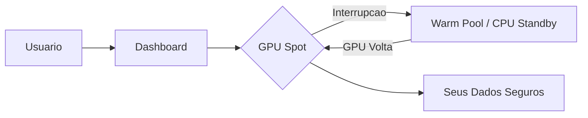

# Bem-vindo ao Dumont Cloud

## O que e o Dumont Cloud?

**Dumont Cloud** e uma plataforma enterprise de GPU Cloud que oferece o melhor custo-beneficio do mercado, combinando GPUs Spot de baixo custo com failover automatico, serverless GPU, e ferramentas avancadas de IA para garantir alta disponibilidade e otimizacao de custos.

### Por que escolher Dumont Cloud?

| Beneficio | Descricao |
|-----------|-----------|
| **89% mais barato** | GPUs ate 10x mais baratas que AWS/GCP |
| **Zero data loss** | Failover automatico preserva seus dados |
| **Serverless GPU** | Pague apenas quando usar (auto-pause/resume) |
| **AI Wizard** | Recomendacoes inteligentes de GPU via IA |
| **Enterprise Ready** | RBAC, SSO (OIDC/SAML), audit logs |
| **Multi-Provider** | VAST.ai, GCP, TensorDock integrados |
| **Setup em 5 min** | Interface simples e intuitiva |

---

## Principais Features

### GPU Management
- **Smart Failover** - Migracao automatica em caso de falha
- **GPU Warm Pool** - GPUs pre-alocadas para failover instantaneo
- **Auto-Hibernation** - Pause automatico de instancias ociosas
- **Spot Instances** - Aproveite precos spot com seguranca

### AI & ML Tools
- **AI Wizard** - Assistente IA para escolha de GPU
- **Model Deploy** - Deploy de LLMs, Whisper, Diffusion models
- **Fine-Tuning** - Jobs distribuidos de fine-tuning
- **ML Marketplace** - Templates prontos para deploy

### Enterprise
- **RBAC** - Controle de acesso por papeis e equipes
- **SSO** - Integracao OpenID Connect e SAML
- **Audit Logs** - Rastreabilidade completa
- **Multi-Currency** - Precos em qualquer moeda

---

## Como Funciona

1. **Voce escolhe** uma GPU no marketplace ou usa o AI Wizard
2. **Lancamos** sua maquina em segundos
3. **Monitoramos** 24/7 por interrupcoes
4. **Se cair**, failover para Warm Pool ou CPU Standby

---

## Stack Tecnica

| Camada | Tecnologia |
|--------|------------|
| Frontend | React 18 + Vite + Tailwind CSS |
| Backend | FastAPI (Python 3.9+) |
| Database | PostgreSQL 16 |
| Storage | Cloudflare R2 |
| Auth | JWT + OIDC + SAML |

---

## Precos

| GPU | Preco/hora | vs AWS |
|-----|------------|--------|
| RTX 4090 | $0.40 | -87% |
| RTX 3090 | $0.30 | -90% |
| A100 40GB | $1.20 | -85% |
| H100 | $2.50 | -80% |
