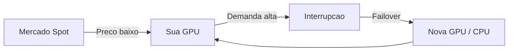

# Spot Market

## O que e Spot Market?

O Spot Market permite alugar GPUs com descontos de ate 90% comparado a precos on-demand. O trade-off e que instancias spot podem ser interrompidas quando a demanda aumenta.

---

## Como Funciona



### Vantagens
- Ate 90% mais barato
- Mesmas GPUs (RTX 4090, A100, H100)
- Failover automatico incluso

### Riscos Mitigados
- Interrupcao: Failover automatico
- Perda de dados: Snapshots continuos
- Downtime: Warm Pool pre-alocado

---

## Precos em Tempo Real

### Dashboard de Precos

1. Acesse **Market** > **Spot Prices**
2. Veja precos atuais por GPU
3. Historico de precos (24h, 7d, 30d)
4. Alertas de preco

### Exemplo de Precos

| GPU | On-Demand | Spot | Economia |
|-----|-----------|------|----------|
| RTX 4090 | $1.50/h | $0.40/h | 73% |
| RTX 3090 | $1.20/h | $0.30/h | 75% |
| A100 40GB | $4.00/h | $1.20/h | 70% |
| H100 | $8.00/h | $2.50/h | 69% |

---

## Estrategias de Uso

### 1. Treinamento Tolerante a Falhas

Ideal para:
- Checkpointing frequente
- Jobs que podem retomar

```python
# Salvar checkpoint a cada epoch
torch.save(model.state_dict(), 'checkpoint.pt')
```

### 2. Inferencia com Failover

Ideal para:
- APIs de inferencia
- Aplicacoes web

Configuracao:
- Habilitar Warm Pool
- Timeout agressivo (30s)

### 3. Desenvolvimento

Ideal para:
- Testes e experimentos
- Notebooks Jupyter

Configuracao:
- Snapshots a cada 1h
- Hibernation apos 30min idle

---

## Monitoramento de Precos

### Alertas de Preco

1. **Market** > **Price Alerts**
2. Defina GPU e preco alvo
3. Receba notificacao quando atingir

### Predicao de Precos

O sistema usa ML para prever precos:
- Tendencia nas proximas 24h
- Melhor horario para lancar
- Probabilidade de interrupcao

---

## API

### Consultar Precos

```bash
curl /api/v1/market/prices?gpu_type=RTX_4090
```

### Resposta

```json
{
  "gpu_type": "RTX_4090",
  "current_price": 0.42,
  "avg_24h": 0.45,
  "min_24h": 0.38,
  "max_24h": 0.52,
  "trend": "stable"
}
```

---

## Melhores Praticas

1. **Sempre habilite failover** - Nao use spot sem protecao
2. **Snapshots frequentes** - Minimo a cada 1h
3. **Checkpointing no codigo** - Salve estado regularmente
4. **Monitore precos** - Use alertas para otimizar custos
5. **Diversifique regioes** - Distribua entre US, EU, Asia
