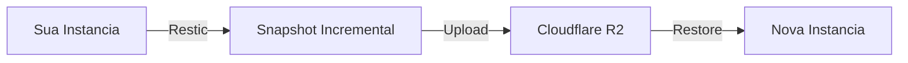

# Auto Backup (Snapshots)

## Visao Geral

O sistema de Auto Backup cria snapshots automaticos das suas instancias usando Restic + Cloudflare R2. Seus dados estao sempre seguros.

---

## Como Funciona



### Tecnologia
- **Restic**: Backup incremental e deduplicado
- **R2**: Storage S3-compatible de baixo custo
- **Criptografia**: AES-256 em repouso

---

## Configuracao

### Via Dashboard

1. **Machines** > Selecione instancia
2. **Settings** > **Backups**
3. Configure:
   - Frequencia (15min, 1h, 6h, 24h)
   - Retencao (7, 30, 90 dias)
   - Paths a incluir/excluir

### Via API

```bash
curl -X POST /api/v1/snapshots/config \
  -d '{
    "instance_id": "abc123",
    "frequency_minutes": 60,
    "retention_days": 30,
    "include_paths": ["/home", "/data"],
    "exclude_paths": ["/tmp", "*.log"]
  }'
```

---

## Snapshots Manuais

### Criar Snapshot

1. **Machines** > Sua instancia
2. Clique em **"Snapshot"**
3. Adicione descricao (opcional)
4. Aguarde conclusao

### Via API

```bash
curl -X POST /api/v1/snapshots \
  -d '{"instance_id": "abc123", "description": "Before training"}'
```

---

## Restaurar Snapshot

### Para Nova Instancia

1. **Snapshots** > Selecione snapshot
2. Clique em **"Restore"**
3. Escolha GPU e regiao
4. Nova instancia criada com dados

### Para Instancia Existente

1. **Machines** > Sua instancia
2. **Actions** > **Restore from Snapshot**
3. Selecione snapshot
4. Confirme (dados atuais serao sobrescritos)

---

## Gerenciamento

### Listar Snapshots

```bash
curl /api/v1/snapshots?instance_id=abc123
```

### Deletar Snapshot

```bash
curl -X DELETE /api/v1/snapshots/{snapshot_id}
```

### Politica de Retencao

| Tipo | Retencao Padrao |
|------|-----------------|
| Automatico | 7 dias |
| Manual | 90 dias |
| Pre-failover | 30 dias |

---

## Custos

### Armazenamento

| Tier | Preco/GB/mes |
|------|--------------|
| Primeiros 10GB | Gratis |
| 10GB - 100GB | $0.015 |
| 100GB+ | $0.010 |

### Transfer

- Upload: Gratis
- Download (restore): $0.01/GB

---

## Performance

### Backup Incremental

Apenas mudancas sao enviadas:

| Cenario | Primeiro Backup | Incrementais |
|---------|-----------------|--------------|
| 50GB de dados | ~10 min | ~30 seg |
| 200GB de dados | ~40 min | ~2 min |

### Restore

| Tamanho | Tempo Estimado |
|---------|----------------|
| 10GB | ~2 min |
| 50GB | ~8 min |
| 200GB | ~30 min |

---

## Melhores Praticas

1. **Frequencia adequada** - Treinamento: 1h, Dev: 6h
2. **Exclua temporarios** - `/tmp`, `*.log`, `__pycache__`
3. **Snapshots antes de experimentos** - Sempre
4. **Teste restores** - Periodicamente
5. **Monitore custos** - Dashboard de storage
