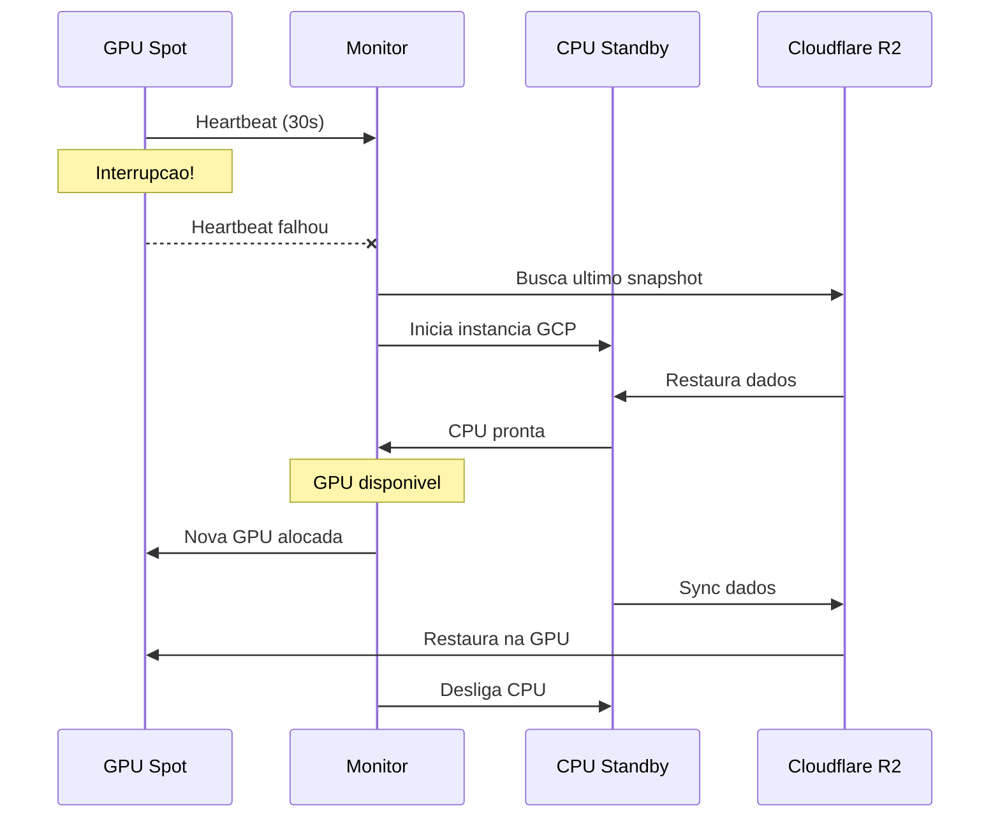

# CPU Standby (Failover)

## O que e CPU Standby?

CPU Standby e o sistema de failover que mantem seus dados seguros quando uma GPU spot e interrompida. Uma instancia CPU na GCP assume temporariamente ate uma nova GPU estar disponivel.

---

## Como Funciona



---

## Configuracao

### Habilitar CPU Standby

1. **Machines** > Selecione instancia
2. **Settings** > **Failover**
3. Ative **"CPU Standby"**
4. Configure:
   - Regiao GCP (us-central1, europe-west1, etc)
   - Tipo de maquina (e2-medium, e2-standard-4)
   - Timeout maximo

### Via API

```bash
curl -X POST /api/v1/standby/configure \
  -d '{
    "instance_id": "abc123",
    "enabled": true,
    "gcp_region": "us-central1",
    "machine_type": "e2-standard-4",
    "max_standby_hours": 24
  }'
```

---

## Tipos de Maquina CPU

| Tipo | vCPUs | RAM | Custo/h | Uso |
|------|-------|-----|---------|-----|
| e2-medium | 2 | 4GB | $0.03 | Dev leve |
| e2-standard-4 | 4 | 16GB | $0.13 | Geral |
| e2-standard-8 | 8 | 32GB | $0.27 | Processamento |
| n2-standard-8 | 8 | 32GB | $0.39 | Alta performance |

---

## Fluxo de Failover

### 1. Deteccao (30-60s)
- Monitor detecta heartbeat ausente
- Confirma interrupcao apos 2 falhas

### 2. Ativacao CPU (1-2min)
- Instancia GCP criada
- Snapshot mais recente baixado
- Servicos iniciados

### 3. Notificacao
- Email enviado
- Webhook disparado
- Dashboard atualizado

### 4. Operacao em CPU
- Voce continua trabalhando
- Dados sincronizados a cada 5min
- Custo reduzido (CPU << GPU)

### 5. Retorno para GPU (2-5min)
- Nova GPU alocada
- Dados sincronizados
- Migracao automatica
- CPU desligada

---

## Tempos Tipicos

| Fase | Tempo |
|------|-------|
| Deteccao de falha | 30-60s |
| Ativacao CPU | 1-2 min |
| Restore dados (50GB) | 2-5 min |
| **Total** | **3-8 min** |

---

## Custos

### Durante Failover

```
Custo = tempo_cpu * preco_cpu
```

Exemplo (4h em e2-standard-4):
- $0.13/h * 4h = $0.52

### Comparacao

| Cenario | Custo 4h | Dados |
|---------|----------|-------|
| Sem failover | $0 | Perdidos |
| CPU Standby | $0.52 | Seguros |
| Warm Pool | $1.60 | Seguros + rapido |

---

## Limitacoes

- **Sem GPU**: Nao roda workloads CUDA
- **Performance**: CPU mais lenta que GPU
- **Latencia**: 3-8 min para ativar

### Quando Usar

- Workloads tolerantes a CPU temporaria
- Custo e prioridade sobre velocidade
- Desenvolvimento e testes

### Quando Usar Warm Pool

- APIs de producao
- SLA de alta disponibilidade
- Workloads GPU-dependentes

---

## API

### Status do Standby

```bash
curl /api/v1/standby/status/{instance_id}
```

### Forcar Failover (teste)

```bash
curl -X POST /api/v1/standby/trigger/{instance_id}
```

### Retornar para GPU

```bash
curl -X POST /api/v1/standby/restore/{instance_id}
```

---

## Troubleshooting

### CPU nao ativa

1. Verifique credenciais GCP
2. Confirme cota disponivel
3. Tente outra regiao

### Restore lento

1. Verifique tamanho do snapshot
2. Considere excluir arquivos grandes
3. Use regiao R2 mais proxima

### Dados desatualizados

1. Verifique frequencia de snapshot
2. Confirme sync funcionando
3. Force sync manual se necessario
