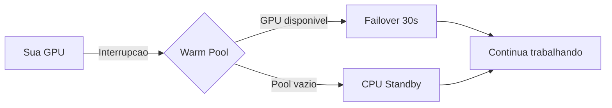

# GPU Warm Pool

## O que e Warm Pool?

O GPU Warm Pool mantem GPUs pre-alocadas e prontas para failover instantaneo. Quando sua GPU spot e interrompida, a migracao para uma GPU do pool leva apenas 30-60 segundos.

---

## Como Funciona



### Vantagens sobre CPU Standby

| Aspecto | CPU Standby | Warm Pool |
|---------|-------------|-----------|
| Tempo failover | 3-8 min | 30-60s |
| Workloads CUDA | Nao | Sim |
| Custo | Baixo | Medio |
| SLA | 99% | 99.9% |

---

## Configuracao

### Habilitar Warm Pool

1. **Machines** > Selecione instancia
2. **Settings** > **Failover**
3. Ative **"GPU Warm Pool"**
4. Configure:
   - GPUs de backup (mesma ou compativel)
   - Regioes permitidas
   - Prioridade vs custo

### Via API

```bash
curl -X POST /api/v1/warmpool/configure \
  -d '{
    "instance_id": "abc123",
    "enabled": true,
    "gpu_types": ["RTX_4090", "RTX_3090"],
    "regions": ["us-west", "us-east", "eu-west"],
    "priority": "speed"
  }'
```

---

## Estrategias

### 1. Dedicated Pool

GPU reservada exclusivamente para voce:
- Garantia de disponibilidade
- Custo fixo mensal
- Ideal para producao

### 2. Shared Pool

Compartilha pool com outros usuarios:
- Custo menor
- Disponibilidade sob demanda
- Ideal para dev/test

### 3. Hybrid

Combina Warm Pool + CPU Standby:
- Warm Pool como primeira opcao
- CPU Standby se pool vazio
- Melhor custo-beneficio

---

## Fluxo de Failover

### 1. Deteccao (10-30s)
- Heartbeat detecta falha
- Busca GPU no pool

### 2. Alocacao (5-10s)
- GPU do pool alocada
- Networking configurado

### 3. Restore (15-30s)
- Snapshot baixado
- Servicos iniciados

### 4. Ready (30-60s total)
- GPU pronta
- IP pode mudar (ou usar IP elastico)
- Notificacao enviada

---

## Custos

### Preco do Warm Pool

```
Custo = taxa_reserva + uso_efetivo
```

| Plano | Taxa/hora | Uso |
|-------|-----------|-----|
| Shared | $0.05 | Preco spot |
| Dedicated | $0.20 | Preco spot |

### Exemplo

RTX 4090 com Dedicated Pool:
- Taxa: $0.20/h * 720h = $144/mes
- Uso (failover): $0.40/h * horas_usadas
- **Total**: $144 + uso

### ROI

Se voce teria 10h de downtime/mes sem failover:
- Custo downtime: $500+ (perda de produtividade)
- Custo Warm Pool: $144
- **Economia**: $356+

---

## Monitoramento

### Dashboard

- Status do pool (verde/amarelo/vermelho)
- GPUs disponiveis por regiao
- Historico de failovers
- Tempo medio de recuperacao

### Metricas

```bash
curl /api/v1/warmpool/metrics
```

```json
{
  "pool_size": 12,
  "available_gpus": 8,
  "avg_failover_time_seconds": 42,
  "failovers_24h": 3,
  "success_rate": 100
}
```

---

## API

### Status do Pool

```bash
curl /api/v1/warmpool/status
```

### Forcar Failover (teste)

```bash
curl -X POST /api/v1/warmpool/test-failover/{instance_id}
```

### Reservar GPU Dedicada

```bash
curl -X POST /api/v1/warmpool/reserve \
  -d '{
    "gpu_type": "RTX_4090",
    "region": "us-west",
    "duration_days": 30
  }'
```

---

## Melhores Praticas

1. **Use IP elastico** - Evita mudanca de IP no failover
2. **Configure multiplas regioes** - Aumenta disponibilidade
3. **Monitore o pool** - Alertas quando baixo
4. **Teste periodicamente** - Simule failovers
5. **Combine com snapshots frequentes** - Dados mais recentes

---

## Comparacao de Estrategias

| Estrategia | Tempo | Custo | SLA | Uso |
|------------|-------|-------|-----|-----|
| Sem failover | - | Baixo | 0% | Experimentos |
| CPU Standby | 3-8min | Baixo | 99% | Dev/Test |
| Shared Pool | 30-60s | Medio | 99.5% | Staging |
| Dedicated Pool | 30-60s | Alto | 99.9% | Producao |
