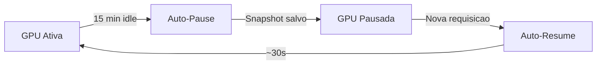

# Serverless GPU

## O que e Serverless GPU?

O modo Serverless permite que suas GPUs sejam automaticamente pausadas quando ociosas e retomadas sob demanda. Voce paga apenas pelo tempo de uso efetivo.

---

## Como Funciona



### Ciclo de Vida

1. **GPU Ativa**: Instancia rodando normalmente
2. **Deteccao de Idle**: Monitora atividade (SSH, GPU usage, requests)
3. **Auto-Pause**: Apos periodo de inatividade, cria snapshot e pausa
4. **Custo Zero**: Enquanto pausada, nao ha cobranca de GPU
5. **Auto-Resume**: Ao receber request, restaura estado e continua

---

## Configuracao

### Via Dashboard

1. Acesse **Machines** > sua instancia
2. Clique em **Settings** > **Serverless**
3. Configure:
   - **Enable Serverless**: Ativar/desativar
   - **Idle Timeout**: Tempo sem atividade (5-60 min)
   - **Keep-alive Endpoints**: URLs que mantem ativa

### Via API

```bash
curl -X POST /api/v1/serverless/enable \
  -d '{
    "instance_id": "abc123",
    "idle_timeout_minutes": 15,
    "keep_alive_paths": ["/health", "/ping"]
  }'
```

---

## Economia

### Exemplo de Uso

| Cenario | Horas/dia ativas | Sem Serverless | Com Serverless |
|---------|------------------|----------------|----------------|
| Dev/Test | 4h | $9.60/dia | $1.60/dia |
| API Inference | 8h | $9.60/dia | $3.20/dia |
| Batch Noturno | 6h | $9.60/dia | $2.40/dia |

> Baseado em RTX 4090 a $0.40/hora

### Calculadora

Para 4h/dia de uso:
- Sem Serverless: $288/mes
- Com Serverless: $48/mes
- **Economia: 83%**

---

## Latencia de Resume

| Tipo de Instancia | Tempo de Resume |
|-------------------|-----------------|
| Pequena (< 50GB) | ~20-30s |
| Media (50-200GB) | ~30-60s |
| Grande (> 200GB) | ~60-120s |

---

## Casos de Uso

### 1. API de Inferencia
```
Usuario -> API Gateway -> Serverless GPU
              [Resume sob demanda]
              [Pausa apos idle]
```

### 2. Desenvolvimento
- GPU ativa apenas durante coding
- Pausa automatica a noite

### 3. Batch Processing
- Resume para processar jobs
- Pausa apos conclusao

### 4. Fine-Tuning Intermitente
- Resume para sessoes de treinamento
- Pausa entre experimentos

---

## Endpoints da API

| Endpoint | Metodo | Descricao |
|----------|--------|-----------|
| `/api/v1/serverless/enable` | POST | Habilita serverless |
| `/api/v1/serverless/disable` | POST | Desabilita |
| `/api/v1/serverless/status/{id}` | GET | Status atual |
| `/api/v1/serverless/pause/{id}` | POST | Pausa manual |
| `/api/v1/serverless/resume/{id}` | POST | Resume manual |

---

## Metricas

### Dashboard Serverless

- **Tempo pausado**: Total de horas em pause
- **Economia acumulada**: $ economizados
- **Latencia media**: Tempo de resume
- **Ciclos pause/resume**: Contagem

---

## Limitacoes

- Tempo minimo de idle: 5 minutos
- Tamanho maximo de snapshot: 1TB
- Resume pode levar 30s-2min
- GPUs spot podem expirar durante pause
