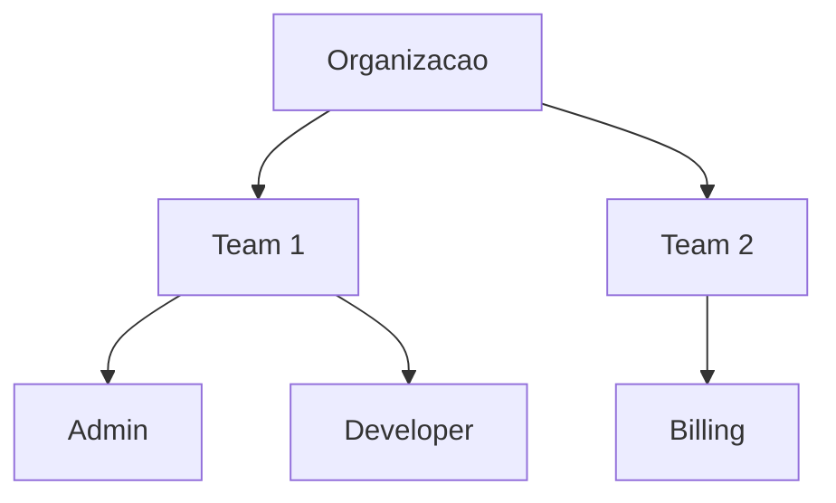

# Features Enterprise

## Visao Geral

O Dumont Cloud oferece features enterprise-grade para organizacoes que precisam de controle, seguranca e compliance.

---

## RBAC - Controle de Acesso

### Estrutura



### Teams

```bash
# Criar team
curl -X POST /api/v1/teams \
  -d '{"name": "ML Team", "description": "Time de ML"}'

# Adicionar membro
curl -X POST /api/v1/teams/{id}/members \
  -d '{"user_id": "user123", "role": "developer"}'
```

### Roles Padrao

| Role | Instancias | Billing | Team | Admin |
|------|------------|---------|------|-------|
| Admin | CRUD | CRUD | CRUD | CRUD |
| Developer | CRUD | Read | Read | - |
| Billing | Read | CRUD | Read | - |
| Viewer | Read | Read | Read | - |

### Roles Customizadas

```bash
curl -X POST /api/v1/roles \
  -d '{
    "name": "ml_engineer",
    "permissions": ["instances:*", "jobs:*", "finetune:*"]
  }'
```

---

## SSO - Single Sign-On

### OpenID Connect (OIDC)

Provedores suportados:
- Okta
- Auth0
- Azure AD
- Google Workspace
- Keycloak

```bash
curl -X POST /api/v1/oidc/configure \
  -d '{
    "provider": "okta",
    "client_id": "xxx",
    "client_secret": "yyy",
    "discovery_url": "https://your-org.okta.com/.well-known/openid-configuration"
  }'
```

### SAML 2.0

```bash
curl -X POST /api/v1/saml/configure \
  -d '{
    "idp_entity_id": "https://idp.example.com",
    "idp_sso_url": "https://idp.example.com/sso",
    "idp_certificate": "..."
  }'
```

---

## Audit Logs

### O que e logado

- Login/logout
- Criacao/destruicao de instancias
- Alteracoes de billing
- Mudancas de permissoes
- Failovers

### Consultar Logs

```bash
curl /api/v1/audit/logs \
  -d '{
    "start_date": "2024-01-01",
    "end_date": "2024-01-31",
    "action": "instance.create"
  }'
```

### Formato

```json
{
  "timestamp": "2024-01-15T10:30:00Z",
  "user_email": "dev@company.com",
  "action": "instance.create",
  "resource_id": "inst_xyz",
  "ip_address": "203.0.113.50"
}
```

---

## Multi-Currency

### Moedas Suportadas

USD, BRL, EUR, GBP + 30 moedas

```bash
curl -X PUT /api/v1/users/me/preferences \
  -d '{"currency": "BRL"}'
```

---

## Reservas de GPU

Garanta capacidade para periodos especificos:

```bash
curl -X POST /api/v1/reservations \
  -d '{
    "gpu_type": "A100_40GB",
    "quantity": 4,
    "start_date": "2024-02-01",
    "end_date": "2024-02-28"
  }'
```

---

## Webhooks

```bash
curl -X POST /api/v1/webhooks \
  -d '{
    "url": "https://your-app.com/webhook",
    "events": ["instance.failed", "failover.completed"],
    "secret": "your-signing-secret"
  }'
```

### Eventos Disponiveis

- `instance.created/started/stopped/failed`
- `failover.started/completed`
- `snapshot.created`
- `billing.low_balance`

---

## API Keys

```bash
# Criar
curl -X POST /api/v1/api-keys \
  -d '{
    "name": "Production API",
    "scopes": ["instances:read", "instances:create"]
  }'

# Listar
curl /api/v1/api-keys

# Revogar
curl -X DELETE /api/v1/api-keys/{key_id}
```

---

## Compliance

### SOC 2 Type II
- Controles auditados
- Logs completos
- Criptografia

### GDPR
- Exportacao de dados
- Direito ao esquecimento
- DPA disponivel

### HIPAA
- BAA disponivel (Enterprise)
- Controles PHI
- Audit trail
