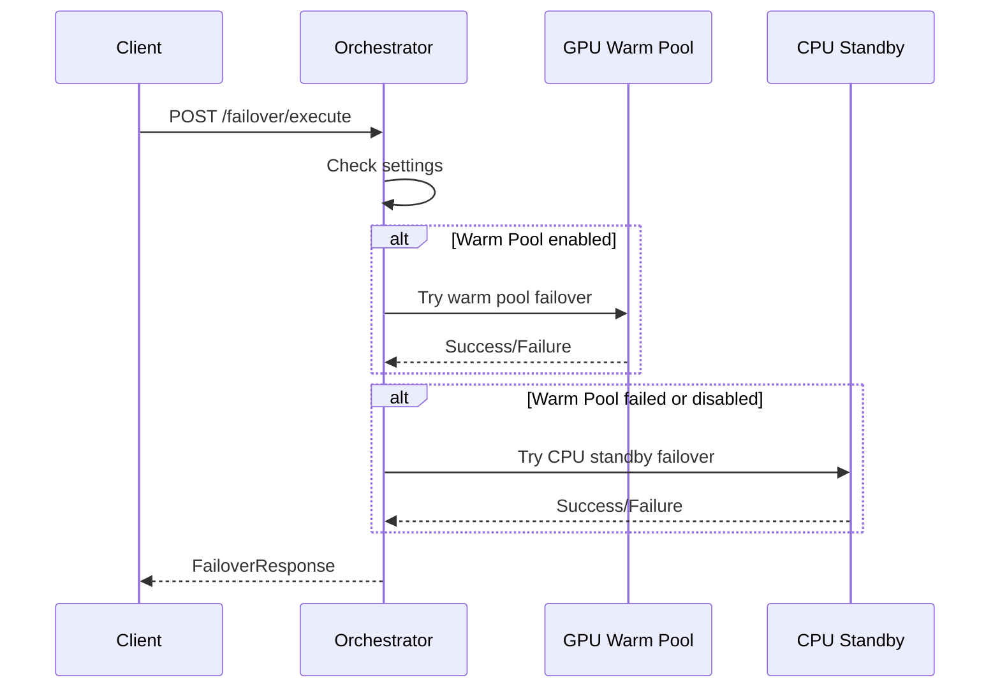

# Failover Orchestrator API

O Failover Orchestrator gerencia a execução de failover automático, tentando múltiplas estratégias na ordem configurada.

## Visão Geral



---

## Endpoints

### POST /failover/execute

Executa failover para uma máquina. O sistema tenta as estratégias configuradas na ordem:
1. GPU Warm Pool (se habilitado e disponível)
2. CPU Standby + Snapshot (como fallback)

**Request:**
```json
{
  "machine_id": 123,
  "gpu_instance_id": 456789,
  "ssh_host": "ssh4.vast.ai",
  "ssh_port": 12345,
  "workspace_path": "/workspace",
  "force_strategy": null
}
```

| Campo | Tipo | Descrição |
|-------|------|-----------|
| machine_id | int | ID da máquina (interno) |
| gpu_instance_id | int | ID da instância GPU (Vast.ai) |
| ssh_host | string | Host SSH atual |
| ssh_port | int | Porta SSH atual |
| workspace_path | string | Caminho do workspace (default: /workspace) |
| force_strategy | string? | Forçar estratégia: warm_pool, cpu_standby, both |

**Response:**
```json
{
  "success": true,
  "failover_id": "fo_abc123",
  "machine_id": 123,
  "strategy_attempted": "both",
  "strategy_succeeded": "warm_pool",
  "new_gpu_id": 789012,
  "new_ssh_host": "ssh5.vast.ai",
  "new_ssh_port": 54321,
  "new_gpu_name": "RTX_4090",
  "warm_pool_attempt_ms": 35000,
  "cpu_standby_attempt_ms": 0,
  "total_ms": 35000,
  "error": null
}
```

**Exemplo curl:**
```bash
curl -X POST https://api.dumontcloud.com/api/v1/failover/execute \
  -H "Authorization: Bearer $API_KEY" \
  -H "Content-Type: application/json" \
  -d '{
    "machine_id": 123,
    "gpu_instance_id": 456789,
    "ssh_host": "ssh4.vast.ai",
    "ssh_port": 12345
  }'
```

---

### GET /failover/readiness/{machine_id}

Verifica se a máquina está pronta para failover.

**Response:**
```json
{
  "machine_id": 123,
  "effective_strategy": "both",
  "warm_pool_ready": true,
  "warm_pool_status": {
    "state": "active",
    "standby_gpu_id": 789
  },
  "cpu_standby_ready": true,
  "cpu_standby_status": {
    "association_exists": true,
    "cpu_vm_running": true
  },
  "overall_ready": true
}
```

**Exemplo curl:**
```bash
curl https://api.dumontcloud.com/api/v1/failover/readiness/123 \
  -H "Authorization: Bearer $API_KEY"
```

---

### GET /failover/status/{machine_id}

Retorna status detalhado das estratégias de failover, incluindo recomendações.

**Response:**
```json
{
  "machine_id": 123,
  "effective_strategy": "both",
  "warm_pool": {
    "enabled": true,
    "state": "active"
  },
  "cpu_standby": {
    "enabled": true,
    "gcp_zone": "europe-west1-b"
  },
  "recommended_action": null
}
```

**Exemplo curl:**
```bash
curl https://api.dumontcloud.com/api/v1/failover/status/123 \
  -H "Authorization: Bearer $API_KEY"
```

---

### POST /failover/test/{machine_id}

Testa failover para uma máquina. Por padrão, faz dry-run sem executar.

**Parâmetros:**
| Parâmetro | Tipo | Descrição |
|-----------|------|-----------|
| gpu_instance_id | int | ID da instância GPU |
| ssh_host | string | Host SSH atual |
| ssh_port | int | Porta SSH atual |
| strategy | string? | Estratégia a testar |
| dry_run | bool | Se True (padrão), apenas simula |

**Response (dry_run=true):**
```json
{
  "dry_run": true,
  "would_succeed": true,
  "readiness": {
    "warm_pool_ready": true,
    "cpu_standby_ready": true
  },
  "message": "Use dry_run=False para executar o failover real"
}
```

**Exemplo curl:**
```bash
curl -X POST "https://api.dumontcloud.com/api/v1/failover/test/123?gpu_instance_id=456&ssh_host=ssh4.vast.ai&ssh_port=12345&dry_run=true" \
  -H "Authorization: Bearer $API_KEY"
```

---

### GET /failover/strategies

Lista as estratégias de failover disponíveis.

**Response:**
```json
{
  "strategies": [
    {
      "id": "warm_pool",
      "name": "GPU Warm Pool",
      "description": "Failover rápido (~30-60s) usando GPU standby no mesmo host",
      "recovery_time": "30-60 segundos",
      "cost": "Apenas armazenamento quando standby está parado",
      "requirements": ["Host com múltiplas GPUs", "Volume compartilhado VAST.ai"]
    },
    {
      "id": "cpu_standby",
      "name": "CPU Standby + Snapshot",
      "description": "Failover via snapshot e nova GPU (~10-20min)",
      "recovery_time": "10-20 minutos",
      "cost": "CPU standby no GCP + armazenamento de snapshots",
      "requirements": ["Credenciais GCP", "Bucket B2/S3 para snapshots"]
    },
    {
      "id": "both",
      "name": "Warm Pool + CPU Standby",
      "description": "Warm Pool como primário, CPU Standby como fallback",
      "recovery_time": "30-60s (warm pool) ou 10-20min (fallback)",
      "cost": "Combinado de ambas estratégias",
      "requirements": ["Requisitos de ambas estratégias"]
    },
    {
      "id": "regional_volume",
      "name": "Regional Volume Failover",
      "description": "Failover usando volume persistente regional (~30-60s)",
      "recovery_time": "30-60 segundos",
      "cost": "Volume regional (~$1-3/mês para 50GB)",
      "requirements": ["Volume VAST.ai na região", "GPUs disponíveis na mesma região"]
    },
    {
      "id": "disabled",
      "name": "Desabilitado",
      "description": "Nenhuma proteção de failover automático",
      "recovery_time": "Manual",
      "cost": "Nenhum",
      "requirements": []
    }
  ]
}
```

---

## Regional Volume Failover

Endpoints para failover usando volumes regionais persistentes.

### POST /failover/regional-volume/create

Cria um volume regional para failover.

**Request:**
```json
{
  "region": "US",
  "size_gb": 50,
  "name": "my-volume"
}
```

**Response:**
```json
{
  "success": true,
  "volume_id": 12345,
  "region": "US",
  "size_gb": 50
}
```

**Exemplo curl:**
```bash
curl -X POST https://api.dumontcloud.com/api/v1/failover/regional-volume/create \
  -H "Authorization: Bearer $API_KEY" \
  -H "Content-Type: application/json" \
  -d '{"region": "US", "size_gb": 50}'
```

---

### POST /failover/regional-volume/failover

Executa failover usando volume regional existente.

**Request:**
```json
{
  "volume_id": 12345,
  "region": "US",
  "old_instance_id": 456789,
  "preferred_gpus": ["RTX_4090", "RTX_3090"],
  "max_price": 0.50,
  "use_spot": true,
  "docker_image": "pytorch/pytorch:latest",
  "mount_path": "/data"
}
```

**Response:**
```json
{
  "success": true,
  "volume_id": 12345,
  "old_instance_id": 456789,
  "new_instance_id": 789012,
  "new_gpu_name": "RTX_4090",
  "region": "US",
  "failover_time_seconds": 45.2,
  "message": "Failover completed successfully",
  "ssh_host": "ssh6.vast.ai",
  "ssh_port": 54321
}
```

---

### GET /failover/regional-volume/list

Lista todos os volumes regionais do usuário.

**Response:**
```json
{
  "volumes": [
    {
      "volume_id": 12345,
      "region": "US",
      "size_gb": 50,
      "status": "available"
    }
  ],
  "count": 1
}
```

---

### GET /failover/regional-volume/{volume_id}

Obtém informações de um volume específico.

---

### DELETE /failover/regional-volume/{volume_id}

Deleta um volume regional. O volume deve estar desanexado.

---

### GET /failover/regional-volume/search/{region}

Busca GPUs disponíveis em uma região para failover.

**Parâmetros:**
| Parâmetro | Tipo | Descrição |
|-----------|------|-----------|
| region | string | Código da região (ex: US, DE, PL) |
| max_price | float? | Preço máximo por hora |
| gpu_name | string? | Nome da GPU específica |

**Response:**
```json
{
  "found": true,
  "offer": {
    "offer_id": 123456,
    "gpu_name": "RTX_4090",
    "num_gpus": 1,
    "price_per_hour": 0.45,
    "reliability": 0.98,
    "geolocation": "US"
  }
}
```

---

## Códigos de Erro

| Código | Descrição |
|--------|-----------|
| 400 | Parâmetros inválidos |
| 404 | Máquina ou volume não encontrado |
| 409 | Failover já em andamento |
| 500 | Erro interno do servidor |

## Troubleshooting

### Failover falha com "warm_pool_not_ready"
- Verifique se o host tem GPUs suficientes
- Confirme que o standby está provisionado

### Failover leva muito tempo
- Warm Pool deve completar em 30-60s
- CPU Standby pode levar 10-20min (normal)
- Verifique velocidade de download do snapshot
