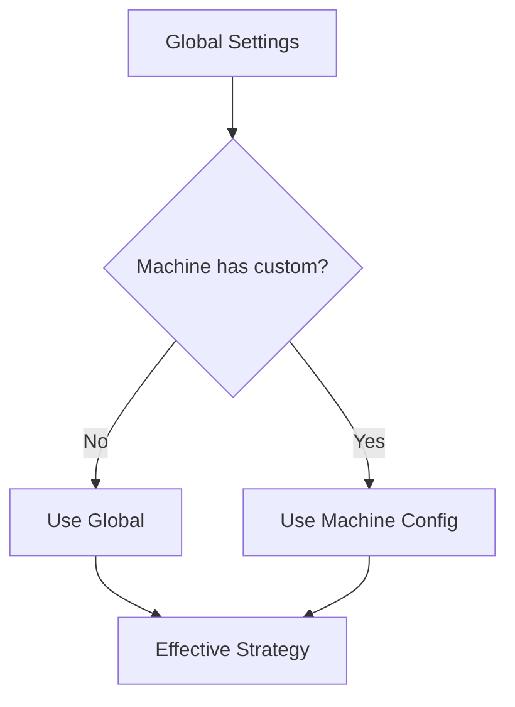

# Failover Settings API

Endpoints para gerenciar configurações de failover globais e por máquina.

## Visão Geral



### Estratégias Disponíveis

| Estratégia | Descrição | Tempo de Recovery |
|------------|-----------|-------------------|
| warm_pool | GPU Warm Pool (mesmo host) | 30-60s |
| cpu_standby | CPU Standby + Snapshot | 10-20min |
| both | Warm Pool + CPU Standby fallback | 30-60s / 10-20min |
| disabled | Sem proteção automática | Manual |

---

## Configurações Globais

### GET /failover/settings/global

Retorna configurações globais de failover (padrão para novas máquinas).

**Response:**
```json
{
  "default_strategy": "both",
  "warm_pool": {
    "enabled": true,
    "min_gpus_per_host": 2,
    "volume_size_gb": 100,
    "auto_provision_standby": true,
    "fallback_to_cpu_standby": true,
    "preferred_gpu_names": ["RTX_4090", "RTX_3090", "A100"],
    "health_check_interval_seconds": 10,
    "failover_timeout_seconds": 120,
    "auto_reprovision_standby": true
  },
  "cpu_standby": {
    "enabled": true,
    "gcp_zone": "europe-west1-b",
    "gcp_machine_type": "e2-medium",
    "gcp_disk_size_gb": 100,
    "gcp_spot": true,
    "sync_interval_seconds": 30,
    "health_check_interval_seconds": 10,
    "failover_threshold": 3,
    "auto_failover": true,
    "auto_recovery": true,
    "snapshot_to_cloud": true
  },
  "auto_apply_to_new_machines": true,
  "notify_on_failover": true,
  "notify_channels": ["email", "slack"],
  "summary": {
    "warm_pool_enabled": true,
    "cpu_standby_enabled": true,
    "description": "GPU Warm Pool (principal) + CPU Standby (fallback)"
  }
}
```

**Exemplo curl:**
```bash
curl https://api.dumontcloud.com/api/v1/failover/settings/global \
  -H "Authorization: Bearer $API_KEY"
```

---

### PUT /failover/settings/global

Atualiza configurações globais de failover.

**Request:**
```json
{
  "default_strategy": "both",
  "warm_pool": {
    "enabled": true,
    "min_gpus_per_host": 2,
    "volume_size_gb": 100,
    "preferred_gpu_names": ["RTX_4090", "A100"]
  },
  "cpu_standby": {
    "enabled": true,
    "gcp_zone": "us-central1-a",
    "gcp_machine_type": "e2-medium",
    "gcp_spot": true
  },
  "auto_apply_to_new_machines": true,
  "notify_on_failover": true,
  "notify_channels": ["email"]
}
```

**Exemplo curl:**
```bash
curl -X PUT https://api.dumontcloud.com/api/v1/failover/settings/global \
  -H "Authorization: Bearer $API_KEY" \
  -H "Content-Type: application/json" \
  -d '{
    "default_strategy": "both",
    "warm_pool": {"enabled": true},
    "cpu_standby": {"enabled": true}
  }'
```

---

## Configurações por Máquina

### GET /failover/settings/machines

Lista configurações de failover de todas as máquinas.

**Response:**
```json
{
  "machines": {
    "123": {
      "machine_id": 123,
      "use_global_settings": false,
      "effective_strategy": "warm_pool",
      "warm_pool": {"enabled": true},
      "cpu_standby": {"enabled": false},
      "stats": {"failover_count": 2}
    },
    "456": {
      "machine_id": 456,
      "use_global_settings": true,
      "effective_strategy": "both",
      "warm_pool": {"enabled": true},
      "cpu_standby": {"enabled": true},
      "stats": {"failover_count": 0}
    }
  },
  "count": 2
}
```

---

### GET /failover/settings/machines/{machine_id}

Retorna configuração de failover de uma máquina específica.

**Response:**
```json
{
  "machine_id": 123,
  "use_global_settings": false,
  "effective_strategy": "warm_pool",
  "warm_pool": {
    "enabled": true,
    "state": "active"
  },
  "cpu_standby": {
    "enabled": false
  },
  "stats": {
    "failover_count": 2,
    "last_failover_at": "2024-12-20T15:30:00Z"
  }
}
```

---

### PUT /failover/settings/machines/{machine_id}

Atualiza configuração de failover de uma máquina.

**Request:**
```json
{
  "use_global_settings": false,
  "strategy": "warm_pool",
  "warm_pool_enabled": true,
  "cpu_standby_enabled": false
}
```

| Campo | Tipo | Descrição |
|-------|------|-----------|
| use_global_settings | bool | Se True, usa config global |
| strategy | string? | warm_pool, cpu_standby, both, disabled |
| warm_pool_enabled | bool | Habilitar warm pool |
| cpu_standby_enabled | bool | Habilitar CPU standby |

**Exemplo curl:**
```bash
curl -X PUT https://api.dumontcloud.com/api/v1/failover/settings/machines/123 \
  -H "Authorization: Bearer $API_KEY" \
  -H "Content-Type: application/json" \
  -d '{
    "use_global_settings": false,
    "strategy": "warm_pool",
    "warm_pool_enabled": true,
    "cpu_standby_enabled": false
  }'
```

---

### DELETE /failover/settings/machines/{machine_id}

Remove configuração personalizada de uma máquina. A máquina volta a usar configurações globais.

**Response:**
```json
{
  "success": true,
  "message": "Machine 123 config deleted, using global settings"
}
```

---

## Endpoints de Conveniência

Atalhos para configurações comuns.

### POST /failover/settings/machines/{machine_id}/use-global

Configura máquina para usar configurações globais.

```bash
curl -X POST https://api.dumontcloud.com/api/v1/failover/settings/machines/123/use-global \
  -H "Authorization: Bearer $API_KEY"
```

---

### POST /failover/settings/machines/{machine_id}/enable-warm-pool

Habilita apenas GPU Warm Pool para uma máquina.

```bash
curl -X POST https://api.dumontcloud.com/api/v1/failover/settings/machines/123/enable-warm-pool \
  -H "Authorization: Bearer $API_KEY"
```

---

### POST /failover/settings/machines/{machine_id}/enable-cpu-standby

Habilita apenas CPU Standby para uma máquina.

```bash
curl -X POST https://api.dumontcloud.com/api/v1/failover/settings/machines/123/enable-cpu-standby \
  -H "Authorization: Bearer $API_KEY"
```

---

### POST /failover/settings/machines/{machine_id}/enable-both

Habilita ambas estratégias (Warm Pool + CPU Standby).

```bash
curl -X POST https://api.dumontcloud.com/api/v1/failover/settings/machines/123/enable-both \
  -H "Authorization: Bearer $API_KEY"
```

---

### POST /failover/settings/machines/{machine_id}/disable-failover

Desabilita failover para uma máquina.

```bash
curl -X POST https://api.dumontcloud.com/api/v1/failover/settings/machines/123/disable-failover \
  -H "Authorization: Bearer $API_KEY"
```

---

## Configurações de Warm Pool

| Campo | Tipo | Default | Descrição |
|-------|------|---------|-----------|
| enabled | bool | true | Habilitar warm pool |
| min_gpus_per_host | int | 2 | Mínimo de GPUs por host |
| volume_size_gb | int | 100 | Tamanho do volume compartilhado |
| auto_provision_standby | bool | true | Provisionar standby automaticamente |
| fallback_to_cpu_standby | bool | true | Usar CPU standby como fallback |
| preferred_gpu_names | list | ["RTX_4090", ...] | GPUs preferidas |
| health_check_interval_seconds | int | 10 | Intervalo de health check |
| failover_timeout_seconds | int | 120 | Timeout do failover |
| auto_reprovision_standby | bool | true | Re-provisionar após failover |

## Configurações de CPU Standby

| Campo | Tipo | Default | Descrição |
|-------|------|---------|-----------|
| enabled | bool | true | Habilitar CPU standby |
| gcp_zone | string | europe-west1-b | Zona do GCP |
| gcp_machine_type | string | e2-medium | Tipo de VM |
| gcp_disk_size_gb | int | 100 | Tamanho do disco |
| gcp_spot | bool | true | Usar VM spot |
| sync_interval_seconds | int | 30 | Intervalo de sync |
| health_check_interval_seconds | int | 10 | Intervalo de health check |
| failover_threshold | int | 3 | Falhas antes de failover |
| auto_failover | bool | true | Failover automático |
| auto_recovery | bool | true | Recovery automático |
| snapshot_to_cloud | bool | true | Backup em cloud |

---

## Códigos de Erro

| Código | Descrição |
|--------|-----------|
| 400 | Estratégia inválida |
| 404 | Máquina não encontrada |
| 500 | Erro interno |
