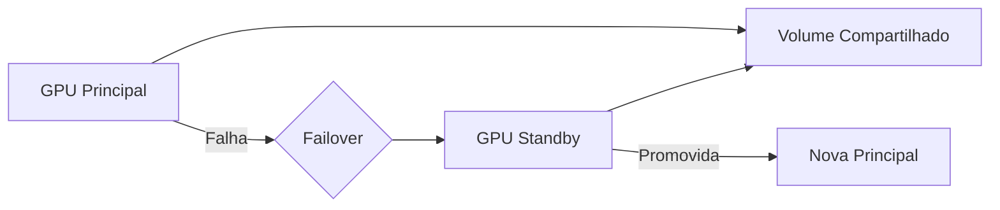
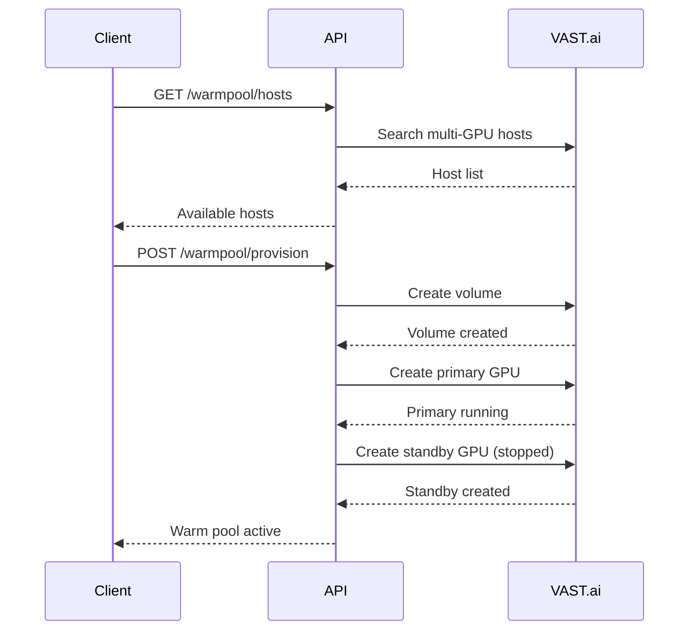

# GPU Warm Pool API

Endpoints para gerenciar GPU Warm Pool - failover rápido usando GPU standby no mesmo host.

## Visão Geral

O GPU Warm Pool provisiona uma GPU standby no mesmo host que a GPU principal, compartilhando um volume. Em caso de falha, o failover acontece em 30-60 segundos.



### Estados do Warm Pool

| Estado | Descrição |
|--------|-----------|
| disabled | Warm pool desabilitado |
| searching | Buscando host com múltiplas GPUs |
| provisioning | Provisionando volume e GPUs |
| active | Warm pool ativo e pronto |
| failover | Failover em andamento |
| degraded | Sem standby disponível |

---

## Endpoints

### GET /warmpool/status/{machine_id}

Retorna status do warm pool para uma máquina.

**Response:**
```json
{
  "machine_id": 123,
  "state": "active",
  "host_machine_id": 88888,
  "volume_id": 12345,
  "primary_gpu_id": 456789,
  "standby_gpu_id": 456790,
  "standby_state": "stopped",
  "primary_ssh_host": "ssh4.vast.ai",
  "primary_ssh_port": 12345,
  "last_health_check": "2024-12-20T15:30:00Z",
  "failover_count": 2,
  "last_failover_at": "2024-12-19T10:00:00Z",
  "error_message": null
}
```

**Exemplo curl:**
```bash
curl https://api.dumontcloud.com/api/v1/warmpool/status/123 \
  -H "Authorization: Bearer $API_KEY"
```

---

### GET /warmpool/hosts

Lista hosts com múltiplas GPUs disponíveis para warm pool.

**Parâmetros:**
| Parâmetro | Tipo | Default | Descrição |
|-----------|------|---------|-----------|
| gpu_name | string? | null | Filtrar por GPU (ex: RTX_4090) |
| min_gpus | int | 2 | Mínimo de GPUs por host |
| max_price | float? | null | Preço máximo por hora |
| verified | bool | true | Apenas hosts verificados |

**Response:**
```json
{
  "hosts": [
    {
      "machine_id": 88888,
      "total_gpus": 4,
      "available_gpus": 3,
      "gpu_name": "RTX_4090",
      "avg_price_per_hour": 0.45,
      "reliability": 0.98,
      "verified": true,
      "geolocation": "US",
      "can_create_warm_pool": true,
      "offers": [
        {
          "offer_id": 123456,
          "machine_id": 88888,
          "gpu_name": "RTX_4090",
          "num_gpus": 1,
          "price_per_hour": 0.45,
          "reliability": 0.98,
          "verified": true,
          "geolocation": "US"
        }
      ]
    }
  ],
  "count": 1
}
```

**Exemplo curl:**
```bash
curl "https://api.dumontcloud.com/api/v1/warmpool/hosts?gpu_name=RTX_4090&min_gpus=2" \
  -H "Authorization: Bearer $API_KEY"
```

---

### POST /warmpool/provision

Provisiona um warm pool em um host específico.

**Request:**
```json
{
  "machine_id": 123,
  "host_machine_id": 88888,
  "gpu_name": "RTX_4090",
  "image": "pytorch/pytorch:2.1.0-cuda12.1-cudnn8-runtime",
  "disk_size": 50,
  "volume_size": 100
}
```

| Campo | Tipo | Default | Descrição |
|-------|------|---------|-----------|
| machine_id | int | - | ID da máquina/instância |
| host_machine_id | int | - | ID do host VAST.ai |
| gpu_name | string? | null | Nome da GPU |
| image | string | pytorch/... | Imagem Docker |
| disk_size | int | 50 | Tamanho do disco em GB |
| volume_size | int | 100 | Tamanho do volume em GB |

**Response:**
```json
{
  "success": true,
  "message": "Warm pool provisioned successfully",
  "status": {
    "machine_id": 123,
    "state": "active",
    "host_machine_id": 88888,
    "volume_id": 12345,
    "primary_gpu_id": 456789,
    "standby_gpu_id": 456790
  }
}
```

**Exemplo curl:**
```bash
curl -X POST https://api.dumontcloud.com/api/v1/warmpool/provision \
  -H "Authorization: Bearer $API_KEY" \
  -H "Content-Type: application/json" \
  -d '{
    "machine_id": 123,
    "host_machine_id": 88888,
    "gpu_name": "RTX_4090"
  }'
```

---

### POST /warmpool/enable/{machine_id}

Habilita warm pool para uma máquina.

**Response:**
```json
{
  "status": "enabled",
  "message": "Warm pool enabled for machine 123"
}
```

**Exemplo curl:**
```bash
curl -X POST https://api.dumontcloud.com/api/v1/warmpool/enable/123 \
  -H "Authorization: Bearer $API_KEY"
```

---

### POST /warmpool/disable/{machine_id}

Desabilita warm pool para uma máquina. O sistema usa CPU Standby como fallback.

**Response:**
```json
{
  "status": "disabled",
  "message": "Warm pool disabled for machine 123",
  "fallback": "cpu_standby"
}
```

---

### POST /warmpool/failover/test/{machine_id}

Testa failover (simula falha da GPU principal).

> **ATENÇÃO:** Isso vai iniciar a GPU standby e parar a principal. Use apenas para testes.

**Response:**
```json
{
  "success": true,
  "message": "Failover test completed",
  "recovery_time_seconds": 35.2,
  "new_primary_gpu_id": 456790
}
```

**Exemplo curl:**
```bash
curl -X POST https://api.dumontcloud.com/api/v1/warmpool/failover/test/123 \
  -H "Authorization: Bearer $API_KEY"
```

---

### DELETE /warmpool/cleanup/{machine_id}

Limpa todos os recursos do warm pool.

**Destrói:**
- GPU principal
- GPU standby
- Volume compartilhado

**Response:**
```json
{
  "success": true,
  "message": "Warm pool for machine 123 cleaned up"
}
```

---

## Fluxo de Provisioning



## Custos

| Componente | Custo Estimado |
|------------|----------------|
| Volume (100GB) | ~$1-3/mês |
| GPU Standby (parada) | $0 (apenas storage) |
| GPU Principal | Preço normal da GPU |

## Troubleshooting

### Estado "degraded"
- Standby pode ter sido destruído
- Use `/warmpool/provision` para re-criar

### Failover lento (>60s)
- Verifique a latência do host
- Considere usar host mais próximo

### Host sem GPUs suficientes
- Busque hosts com `min_gpus=2` ou mais
- GPUs populares podem ter fila
