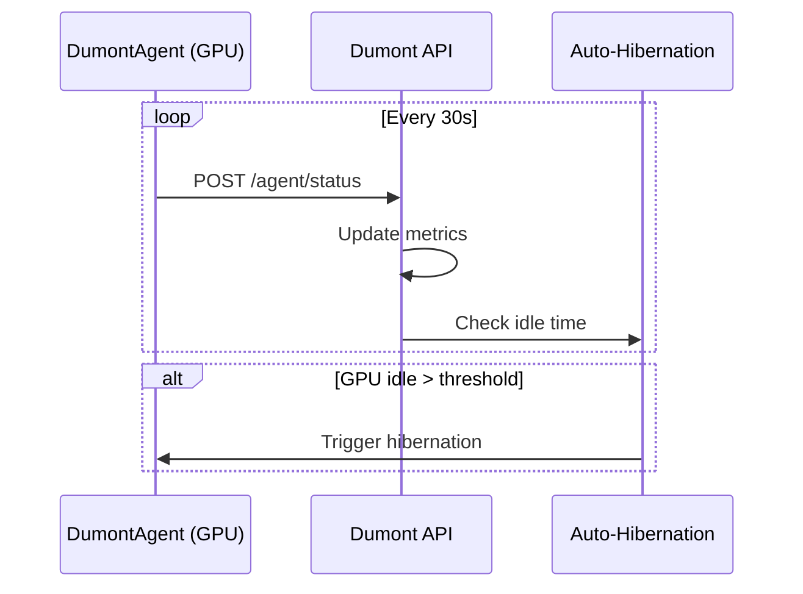

# Agent Status API

Endpoints para comunicação com o DumontAgent instalado nas GPUs.

## Visão Geral

O DumontAgent é um daemon que roda nas instâncias GPU e envia:
- Heartbeats a cada 30 segundos
- Métricas de GPU (utilização, memória, temperatura)
- Status de atividade para auto-hibernação



---

## Endpoints

### POST /agent/status

Recebe heartbeat/status do DumontAgent. Chamado a cada 30 segundos pelo agente.

**Request:**
```json
{
  "instance_id": 456789,
  "hostname": "gpu-001",
  "timestamp": "2024-12-20T15:30:00Z",
  "gpu_metrics": {
    "utilization_percent": 85,
    "memory_used_mb": 18432,
    "memory_total_mb": 24576,
    "temperature_celsius": 72,
    "power_watts": 320
  },
  "process_count": 3,
  "active_users": 1,
  "last_activity": "2024-12-20T15:29:45Z",
  "agent_version": "1.2.0"
}
```

| Campo | Tipo | Descrição |
|-------|------|-----------|
| instance_id | int | ID da instância Vast.ai |
| hostname | string | Hostname da máquina |
| timestamp | string | Timestamp do heartbeat |
| gpu_metrics | object | Métricas da GPU |
| process_count | int | Número de processos GPU |
| active_users | int | Usuários ativos (SSH/Jupyter) |
| last_activity | string | Última atividade detectada |
| agent_version | string | Versão do agente |

**Response:**
```json
{
  "success": true,
  "commands": [],
  "hibernate_in_seconds": null,
  "next_heartbeat_in": 30
}
```

| Campo | Tipo | Descrição |
|-------|------|-----------|
| success | bool | Status do heartbeat |
| commands | list | Comandos para o agente executar |
| hibernate_in_seconds | int? | Segundos até hibernação (se agendada) |
| next_heartbeat_in | int | Segundos até próximo heartbeat |

**Exemplo curl:**
```bash
curl -X POST https://api.dumontcloud.com/api/v1/agent/status \
  -H "Content-Type: application/json" \
  -d '{
    "instance_id": 456789,
    "hostname": "gpu-001",
    "timestamp": "2024-12-20T15:30:00Z",
    "gpu_metrics": {
      "utilization_percent": 85,
      "memory_used_mb": 18432,
      "memory_total_mb": 24576
    }
  }'
```

---

### GET /agent/instances

Lista instâncias com agentes ativos.

**Response:**
```json
{
  "instances": [
    {
      "instance_id": 456789,
      "hostname": "gpu-001",
      "last_heartbeat": "2024-12-20T15:30:00Z",
      "status": "active",
      "gpu_utilization": 85,
      "memory_used_percent": 75,
      "idle_seconds": 0,
      "agent_version": "1.2.0"
    },
    {
      "instance_id": 456790,
      "hostname": "gpu-002",
      "last_heartbeat": "2024-12-20T15:25:00Z",
      "status": "idle",
      "gpu_utilization": 0,
      "memory_used_percent": 10,
      "idle_seconds": 300,
      "agent_version": "1.2.0"
    }
  ],
  "count": 2,
  "active_count": 1,
  "idle_count": 1
}
```

**Exemplo curl:**
```bash
curl https://api.dumontcloud.com/api/v1/agent/instances \
  -H "Authorization: Bearer $API_KEY"
```

---

### GET /agent/instances/{instance_id}

Status detalhado de uma instância específica.

**Response:**
```json
{
  "instance_id": 456789,
  "hostname": "gpu-001",
  "status": "active",
  "last_heartbeat": "2024-12-20T15:30:00Z",
  "heartbeat_count": 1440,
  "uptime_hours": 12,
  "gpu_metrics": {
    "utilization_percent": 85,
    "memory_used_mb": 18432,
    "memory_total_mb": 24576,
    "temperature_celsius": 72,
    "power_watts": 320
  },
  "activity": {
    "last_activity": "2024-12-20T15:29:45Z",
    "idle_seconds": 15,
    "process_count": 3,
    "active_users": 1
  },
  "hibernation": {
    "enabled": true,
    "threshold_minutes": 30,
    "scheduled": false,
    "scheduled_at": null
  },
  "agent_version": "1.2.0"
}
```

---

### POST /agent/instances/{instance_id}/keep-alive

Adia hibernação por N minutos. Útil para manter a instância ativa durante períodos de baixa utilização.

**Parâmetros:**
| Parâmetro | Tipo | Default | Descrição |
|-----------|------|---------|-----------|
| minutes | int | 30 | Minutos para adiar hibernação |

**Response:**
```json
{
  "success": true,
  "instance_id": 456789,
  "hibernation_postponed_until": "2024-12-20T16:00:00Z",
  "message": "Hibernation postponed by 30 minutes"
}
```

**Exemplo curl:**
```bash
curl -X POST "https://api.dumontcloud.com/api/v1/agent/instances/456789/keep-alive?minutes=60" \
  -H "Authorization: Bearer $API_KEY"
```

---

## Integração com Auto-Hibernação

O DumontAgent trabalha com o sistema de auto-hibernação:

1. **Heartbeat** - Agente envia status a cada 30s
2. **Idle Detection** - API detecta GPU ociosa (utilização < 5%)
3. **Threshold** - Após X minutos ociosa, agenda hibernação
4. **Notification** - Resposta do heartbeat inclui tempo até hibernação
5. **Graceful Shutdown** - Agente pode salvar estado antes de hibernar

### Comandos Disponíveis

O campo `commands` na resposta pode incluir:

| Comando | Descrição |
|---------|-----------|
| `hibernate` | Iniciar processo de hibernação |
| `snapshot` | Criar snapshot imediato |
| `update` | Atualizar versão do agente |
| `restart` | Reiniciar serviços |

---

## Instalação do Agente

O DumontAgent é instalado automaticamente ao criar uma instância, mas pode ser instalado manualmente:

```bash
# Via pip
pip install dumont-agent

# Iniciar
dumont-agent --instance-id 456789 --api-url https://api.dumontcloud.com
```

---

## Troubleshooting

### Agente não aparece na lista
- Verifique se o agente está rodando: `systemctl status dumont-agent`
- Confirme conectividade com a API
- Verifique logs: `journalctl -u dumont-agent`

### Heartbeats atrasados
- Latência de rede
- Agente sobrecarregado
- API rate limiting

### Hibernação não funciona
- Verifique se auto-hibernation está habilitada nas configurações
- Confirme threshold de idle time
- Verifique se há processos GPU ativos
