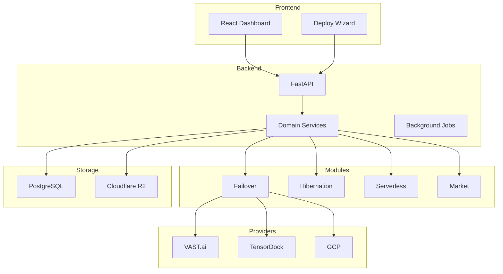
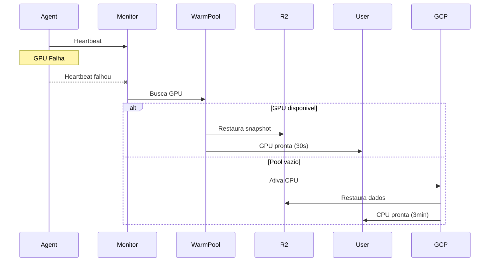

# Arquitetura do Sistema

## Visao Geral

O Dumont Cloud e construido com arquitetura Clean/DDD, focada em resiliencia, escalabilidade e baixo custo.

---

## Diagrama de Alto Nivel



---

## Estrutura do Projeto

```
dumontcloud/
├── src/                    # Backend FastAPI
│   ├── main.py             # App factory
│   ├── api/v1/             # 38 endpoints
│   ├── core/               # Config, security
│   ├── domain/             # DDD layer
│   ├── models/             # 29 SQLAlchemy models
│   ├── services/           # 58+ services
│   ├── modules/            # 14 feature modules
│   └── infrastructure/     # Providers
│
├── web/                    # Frontend React
│   ├── src/pages/          # 29+ pages
│   ├── src/components/     # 118+ components
│   └── src/api/            # API client
│
├── tests/                  # 73+ test files
├── migrations/             # Alembic
└── Live-Doc/               # Esta documentacao
```

---

## Backend Stack

| Componente | Tecnologia |
|------------|------------|
| Framework | FastAPI |
| ORM | SQLAlchemy 2.0 |
| Database | PostgreSQL 16 |
| Validation | Pydantic 2 |
| Auth | JWT + OIDC + SAML |
| Scheduler | APScheduler |
| Storage | Cloudflare R2 |
| Backup | Restic |

---

## Frontend Stack

| Componente | Tecnologia |
|------------|------------|
| Framework | React 18 |
| Build | Vite 5 |
| Styling | Tailwind CSS |
| State | Redux Toolkit |
| Charts | ApexCharts |
| Testing | Playwright |

---

## Modulos Principais

### 1. Failover
Orquestracao de failover GPU -> Warm Pool -> CPU

### 2. Hibernation
Auto-pause de instancias ociosas

### 3. Serverless
Resume sob demanda

### 4. Market
Monitoramento e predicao de precos

### 5. Warmpool
Pool de GPUs pre-alocadas

---

## Fluxo de Failover



---

## Banco de Dados

### Principais Tabelas

- `users` - Contas
- `teams` / `roles` / `permissions` - RBAC
- `instances` / `instance_status` - Maquinas
- `snapshots` - Backups
- `machine_history` - Reliability
- `price_history` - Precos

---

## Seguranca

- JWT com rotacao
- OIDC / SAML SSO
- API Keys com scopes
- Criptografia AES-256
- Audit logging
