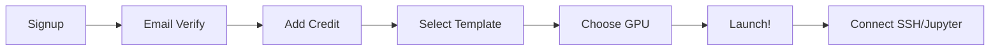

# Guia de Layout MVP para Plataformas GPU Cloud

## Pesquisa de Mercado 2024-2025

Este documento consolida pesquisa aprofundada sobre as melhores praticas de UX/UI para plataformas de GPU Cloud, baseado em analise de concorrentes e tendencias do setor.

---

## Principios Fundamentais de UX para AI Engineers

### 1. Informacao Condensada e Bem Hierarquizada

AI Engineers e ML Developers **preferem interfaces densas em informacao**, desde que haja hierarquia visual clara.

```
✅ BOM: Dashboard com muitas metricas organizadas em cards
❌ RUIM: Interface minimalista demais que esconde informacoes
```

**Recomendacoes:**
- Reduza margens para caber mais informacao
- Use cores para hierarquia (primario, secundario, terciario)
- Agrupe metricas relacionadas em cards
- Permita expansao/colapso de secoes

### 2. Metadata Parseado e Pesquisavel

Usuarios querem **filtrar, ordenar e buscar** rapidamente.

| Elemento | Implementacao |
|----------|---------------|
| Tabelas | Colunas sortaveis, filtros por coluna |
| Tags | Categorizacao visual (GPU tipo, regiao, status) |
| Side Drawers | Detalhes expandidos sem sair da pagina |
| Search | Busca global com autocomplete |

### 3. Lei de Jakob - Siga Padroes Estabelecidos

Usuarios ja conhecem interfaces como AWS Console, GCP, Vercel. **Nao reinvente a roda.**

**Padroes a seguir:**
- Sidebar esquerda para navegacao
- Header com user menu e notificacoes
- Cards para recursos (maquinas, volumes)
- Modais para acoes destrutivas
- Toasts para feedback

---

## Analise Competitiva Detalhada

### Vast.ai
| Aspecto | Nota | Observacao |
|---------|------|------------|
| Facilidade | 3.5/5 | Interface simples mas requer curva de aprendizado |
| Design | 3.5/5 | Funcional, nao muito polido |
| Preco | 5/5 | Mais barato do mercado |
| **Diferencial** | - | Marketplace com precos dinamicos |

**UX Highlights:**
- Busca com filtros avancados (GPU, RAM, preco, regiao)
- Templates pre-configurados
- CLI poderoso para automacao

**Problemas:**
- "Not the most user friendly platform"
- Curva de aprendizado para iniciantes
- Interface pode parecer confusa

---

### RunPod
| Aspecto | Nota | Observacao |
|---------|------|------------|
| Facilidade | 4.5/5 | Muito intuitivo |
| Design | 4/5 | Interface limpa e moderna |
| Preco | 4/5 | Competitivo |
| **Diferencial** | - | One-Click Templates |

**UX Highlights:**
- **One-Click Templates** para PyTorch, ComfyUI, etc
- Iniciantes conseguem comecar em menos de 5 minutos
- Interface projetada especificamente para AI workloads
- Serverless com autoscaling

**Por que funciona:**
- Elimina complexidade de setup
- Feedback visual claro
- Documentacao integrada

---

### Lambda Labs
| Aspecto | Nota | Observacao |
|---------|------|------------|
| Facilidade | 2.5/5 | Focado em power users |
| Design | 4/5 | Profissional |
| Preco | 3/5 | Premium |
| **Diferencial** | - | Jupyter Notebook integrado |

**UX Highlights:**
- Jupyter Notebook direto do dashboard
- Web Terminal no navegador
- Lambda Stack pre-instalado (PyTorch, TensorFlow, CUDA)

**Problemas:**
- Menos enfase em UX para iniciantes
- Suporte com rating baixo (2/5)

---

### GMI Cloud
| Aspecto | Nota | Observacao |
|---------|------|------------|
| Facilidade | 4.5/5 | Self-service simplificado |
| Design | 4/5 | Moderno |
| Preco | 5/5 | Muito competitivo |
| **Diferencial** | - | Cluster Engine para MLOps |

**UX Highlights:**
- Portal self-service com SSH simples
- Cluster Engine simplifica orquestracao
- Precos transparentes sem taxas ocultas

---

## Features Essenciais para MVP

### Tier 1: Must-Have (Lancamento)

| Feature | Descricao | Prioridade |
|---------|-----------|------------|
| **One-Click Deploy** | Lancar GPU com 1 clique | P0 |
| **Templates** | Ambientes pre-configurados (PyTorch, TF) | P0 |
| **Pricing Display** | Tabela clara de precos por GPU | P0 |
| **SSH Access** | Conexao SSH com chaves | P0 |
| **Dashboard Basico** | Status das maquinas, saldo | P0 |
| **Billing Simples** | Adicionar creditos, ver historico | P0 |

### Tier 2: Should-Have (V1.1)

| Feature | Descricao | Prioridade |
|---------|-----------|------------|
| **Jupyter Notebook** | Notebook integrado no browser | P1 |
| **Web Terminal** | Terminal SSH no navegador | P1 |
| **GPU Metrics** | Monitoramento de GPU em tempo real | P1 |
| **Search/Filter** | Buscar GPUs por tipo, preco, regiao | P1 |
| **API Access** | REST API para automacao | P1 |
| **Notificacoes** | Alertas de saldo baixo, maquina parada | P1 |

### Tier 3: Nice-to-Have (V2.0)

| Feature | Descricao | Prioridade |
|---------|-----------|------------|
| **AI Wizard** | Recomendacao automatica de GPU | P2 |
| **Auto-scaling** | Escalar automaticamente | P2 |
| **Spot Instances** | GPUs com desconto (interruptiveis) | P2 |
| **CLI** | Ferramenta de linha de comando | P2 |
| **Team Management** | Multi-usuarios, roles | P2 |
| **Cost Analytics** | Analise de gastos | P2 |

---

## Fluxo de Onboarding Ideal

### Modelo "Time to First GPU" < 5 minutos



### Etapas Detalhadas

#### 1. Signup (30 segundos)
- Email + Senha
- OU OAuth (Google/GitHub)
- Sem exigir cartao inicialmente

#### 2. Verificacao (30 segundos)
- Email de confirmacao com link
- Magic link para login automatico

#### 3. Adicionar Creditos (1 minuto)
- PIX (instantaneo)
- Cartao de credito
- **Trial gratuito** sem cartao

#### 4. Selecionar Template (30 segundos)
- Cards visuais com logos
- PyTorch, TensorFlow, ComfyUI, Ollama
- "Custom" para Docker proprio

#### 5. Escolher GPU (30 segundos)
- Lista filtrada por template compativel
- Preco/hora visivel
- Indicador de disponibilidade

#### 6. Lancar (10 segundos)
- Loading state claro
- Estimativa de tempo

#### 7. Conectar (1 minuto)
- Botao "Open Jupyter"
- Botao "Copy SSH Command"
- Botao "Open Terminal"

---

## Layout de Dashboard Recomendado

### Estrutura de Navegacao

```
+------------------+--------------------------------+
|     SIDEBAR      |          MAIN CONTENT          |
+------------------+--------------------------------+
| Logo             | Header (Search, Notifications) |
|                  |--------------------------------|
| Dashboard        |                                |
| Machines    →    | [Cards de Maquinas Ativas]     |
| GPU Metrics      |                                |
| Billing          | [Grafico de Uso]               |
| Spot Market      |                                |
| Settings         | [Alertas / Notificacoes]       |
|                  |                                |
| [+ Nova Maquina] |                                |
+------------------+--------------------------------+
```

### Cards de Maquina

```
+-----------------------------------------------+
| [Status: ●] RTX 4090 - instance-abc123        |
|-----------------------------------------------|
| GPU: 95% | RAM: 12/24GB | Disk: 45/100GB      |
| Custo: $0.40/h | Uptime: 2h 30m               |
|-----------------------------------------------|
| [SSH] [Jupyter] [Terminal] [Stop] [Delete]    |
+-----------------------------------------------+
```

### Elementos Essenciais do Header

```
+---------------------------------------------------------------+
| [Logo]  [Search: Ctrl+K]        [Saldo: $45.20] [🔔] [Avatar] |
+---------------------------------------------------------------+
```

---

## Padroes de Design para GPU Cloud

### 1. Status Indicators

| Status | Cor | Icone |
|--------|-----|-------|
| Running | Verde | ● |
| Starting | Amarelo | ◐ (animado) |
| Stopping | Laranja | ◐ (animado) |
| Stopped | Cinza | ○ |
| Error | Vermelho | ✕ |

### 2. Pricing Display

**Melhor pratica: Tabela comparativa clara**

```
+----------+--------+----------+---------+
| GPU      | VRAM   | $/hora   | vs AWS  |
+----------+--------+----------+---------+
| RTX 4090 | 24GB   | $0.40    | -87%    |
| A100     | 40GB   | $1.20    | -85%    |
| H100     | 80GB   | $2.50    | -80%    |
+----------+--------+----------+---------+
```

### 3. Call-to-Actions

**Primarios (verde/azul):**
- "Lancar GPU"
- "Adicionar Creditos"
- "Conectar"

**Secundarios (outline):**
- "Ver Detalhes"
- "Configurar"

**Destrutivos (vermelho, com confirmacao):**
- "Deletar"
- "Parar"

### 4. Empty States

Quando nao ha maquinas:

```
+-----------------------------------------------+
|                                               |
|     🖥️ Nenhuma maquina ativa                 |
|                                               |
|     Lance sua primeira GPU em segundos!       |
|                                               |
|     [+ Lancar GPU]                            |
|                                               |
+-----------------------------------------------+
```

### 5. Loading States

- Skeleton screens para listas
- Spinners para acoes
- Progress bars para operacoes longas
- Estimativa de tempo restante

---

## Metricas de Sucesso do MVP

### KPIs de Onboarding

| Metrica | Target |
|---------|--------|
| Time to First GPU | < 5 min |
| Signup to Active | < 10 min |
| Drop-off Rate (signup) | < 20% |
| Drop-off Rate (payment) | < 40% |

### KPIs de Retencao

| Metrica | Target |
|---------|--------|
| DAU/MAU | > 30% |
| Churn Rate Mensal | < 5% |
| NPS Score | > 50 |
| Support Tickets/User | < 0.5 |

### KPIs de UX

| Metrica | Target |
|---------|--------|
| Time to Complete Task | Benchmark -20% |
| Error Rate | < 5% |
| Task Success Rate | > 95% |
| SUS Score | > 70 |

---

## Recomendacoes Finais para Dumont Cloud

### O Diferencial

Baseado na pesquisa, o diferencial do Dumont Cloud deve ser:

1. **Simplicidade do RunPod** + **Precos do Vast.ai**
2. **One-Click Templates** como feature principal
3. **Failover automatico** (CPU Standby) como proposta unica
4. **UX em Portugues** para mercado brasileiro

### Proximos Passos

1. [ ] Implementar One-Click Templates
2. [ ] Redesenhar dashboard com cards de maquina
3. [ ] Simplificar fluxo de onboarding
4. [ ] Adicionar Jupyter/Terminal no browser
5. [ ] Melhorar visualizacao de precos
6. [ ] Implementar busca global (Ctrl+K)

---

## Referencias

- Vast.ai Documentation
- RunPod Templates Guide
- Lambda Labs Interface
- GMI Cloud Blog
- Cloudscape Design System (AWS)
- UX Design for AI Engineers (UX Collective)
- GPU Cloud UX Comparison (LLM Utils)
