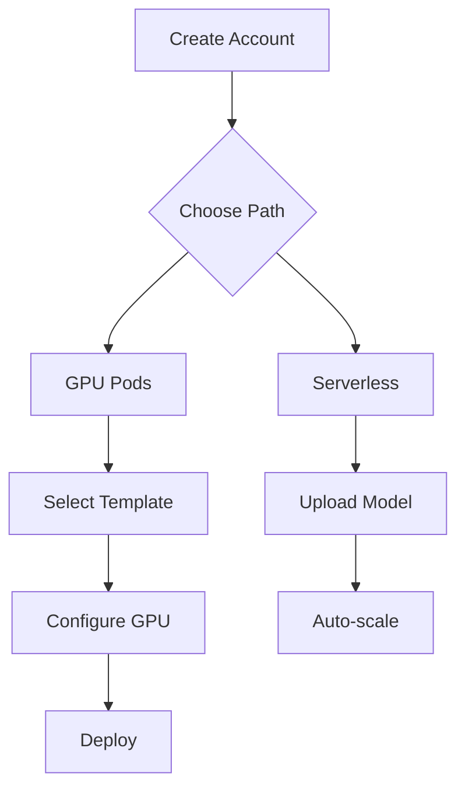

# Analise de Concorrentes GPU Cloud 2025

## Visao Geral do Mercado

O mercado de GPU Cloud cresceu exponencialmente com a explosao de AI/ML. Os principais players se dividem em:

1. **Hyperscalers**: AWS, GCP, Azure (caro, enterprise)
2. **Especializados**: Lambda Labs, CoreWeave (foco AI)
3. **Marketplaces**: Vast.ai, RunPod (preco baixo)
4. **Agregadores**: Shadeform, GPU Trader (multi-cloud)

---

## Comparativo Detalhado

### Tabela de Comparacao

| Provedor | Preco A100/h | Facilidade | Design | Suporte | Target |
|----------|--------------|------------|--------|---------|--------|
| **Vast.ai** | $1.00-1.50 | 3.5/5 | 3.5/5 | 3/5 | Budget-conscious |
| **RunPod** | $1.20-1.80 | 4.5/5 | 4/5 | 4/5 | Beginners |
| **Lambda Labs** | $1.99 | 2.5/5 | 4/5 | 2/5 | Researchers |
| **CoreWeave** | $2.21 | 3.5/5 | 4.5/5 | 4.5/5 | Enterprise |
| **AWS** | $4.00+ | 3/5 | 3.5/5 | 4/5 | Enterprise |
| **GCP** | $3.50+ | 3.5/5 | 4/5 | 4/5 | Enterprise |

---

## Vast.ai - Deep Dive

### Modelo de Negocio
- **Marketplace P2P**: Hosts individuais oferecem GPUs
- **Precos dinamicos**: Leilao/spot baseado em oferta e demanda
- **Margem baixa**: ~15-20% da transacao

### Interface

#### Pontos Fortes
- **Busca poderosa**: Filtros por GPU, RAM, disco, preco, regiao
- **Templates**: PyTorch, TensorFlow, ComfyUI pre-configurados
- **CLI robusto**: `vastai search offers`, `vastai create instance`
- **Precos transparentes**: Custo/hora visivel em todas as GPUs
- **Dashboard de ofertas**: Visualizacao tipo marketplace

#### Pontos Fracos
- Interface pode parecer "abarrotada"
- Curva de aprendizado inicial
- Algumas GPUs tem confiabilidade baixa
- Setup de SSH keys pode confundir iniciantes

### Screenshots Conceituais

```
SEARCH GPU OFFERS
+------------+--------+------+-------+-------+
| GPU Type ▼ | Min RAM| Disk | Price | Avail |
+------------+--------+------+-------+-------+
| RTX 4090   | 24GB   | 100GB| $0.40 | ●●●●● |
| RTX 3090   | 24GB   | 50GB | $0.28 | ●●●○○ |
| A100 40GB  | 40GB   | 200GB| $1.10 | ●●○○○ |
+------------+--------+------+-------+-------+
       [Filter] [Sort by Price ▼] [Search]
```

### Licoes para Dumont
1. Implementar filtros de busca avancados
2. Mostrar indicador de confiabilidade
3. Permitir ordenacao por multiplos criterios
4. CLI e preciso para power users

---

## RunPod - Deep Dive

### Modelo de Negocio
- **Managed Infrastructure**: RunPod gerencia os servidores
- **Serverless + On-demand**: Duas opcoes de compute
- **Templates ecosystem**: Facilita onboarding

### Interface

#### Pontos Fortes
- **One-Click Templates**: Destaque absoluto
- **Interface limpa**: Menos e mais
- **Onboarding < 5 min**: Mais rapido do mercado
- **Serverless nativo**: Deploy de modelos sem infra
- **GPU Pods**: Analogia simples e intuitiva

#### Pontos Fracos
- Menos opcoes de customizacao
- Precos ligeiramente mais altos que Vast
- Menos GPUs disponiveis

### Flow de Onboarding



### Licoes para Dumont
1. **Templates sao essenciais** - Primeiro ponto de contato
2. **Simplicidade > Features** - Menos opcoes, mais clareza
3. **Serverless como diferencial** - Mercado crescente
4. **"GPU Pods"** - Naming amigavel funciona

---

## Lambda Labs - Deep Dive

### Modelo de Negocio
- **Enterprise-focused**: Clusters dedicados
- **On-demand cloud**: Para pesquisadores
- **Hardware proprio**: Lambda GPU clusters

### Interface

#### Pontos Fortes
- **Jupyter integrado**: Notebook direto do dashboard
- **Lambda Stack**: PyTorch, TF, CUDA pre-instalados
- **Web Terminal**: SSH no browser
- **API simples**: REST API bem documentada

#### Pontos Fracos
- Menos enfase em UX para iniciantes
- Suporte com reviews negativos
- Precos mais altos que marketplaces
- Waiting list para algumas GPUs

### Diferencial Tecnico

```python
# Lambda oferece ambientes prontos
# Nao precisa instalar nada

import torch
print(torch.cuda.is_available())  # True
print(torch.cuda.get_device_name(0))  # A100
```

### Licoes para Dumont
1. **Jupyter no browser e table stakes**
2. **Pre-instalar frameworks ML**
3. **Web Terminal para debug rapido**
4. **Suporte e diferencial** - Lambda falha aqui

---

## CoreWeave - Deep Dive

### Modelo de Negocio
- **Enterprise cloud**: SLAs, suporte 24/7
- **Kubernetes-native**: DevOps-friendly
- **Bare-metal performance**: Sem virtualizacao

### Interface

#### Pontos Fortes
- **Mission Control**: Observabilidade avancada
- **Kubernetes nativo**: Familiar para DevOps
- **Telemetry Relay**: Logs, metricas, auditoria
- **Cluster health**: Monitoramento automatico

#### Pontos Fracos
- Overkill para usuarios individuais
- Complexidade do Kubernetes
- Precos enterprise

### Licoes para Dumont
1. **Observabilidade avancada** - Para plano Enterprise
2. **Kubernetes opcional** - Nao forcart complexidade
3. **SLAs claros** - Para clientes B2B

---

## Agregadores Emergentes

### Shadeform
- Unified API para 20+ provedores
- Real-time pricing across clouds
- Billing centralizado

### Prime Intellect
- Compute exchange com reviews de usuarios
- Distributed training focus
- Community ratings de confiabilidade

### GPU Trader
- One-click deploy com storage persistente
- Foco em ComfyUI/Stable Diffusion
- Templates especificos para AI art

### Node AI
- 50+ provedores integrados
- Best price/performance auto-selection
- One-click deployment

---

## Tendencias de UX 2025

### 1. One-Click Everything
Usuarios esperam complexidade zero. O click-to-deploy e padrao.

### 2. Templates > Custom
80% dos usuarios querem ambientes prontos. Customizacao e secundaria.

### 3. Storage Persistente
Dor principal: perder dados ao trocar GPU. Volumes que seguem o usuario.

### 4. Precos Transparentes
Hyperscalers sao opacos. Transparencia e diferencial.

### 5. Jupyter/VS Code Nativo
Terminal + Notebook no browser. Sem instalacao local.

### 6. AI-Assisted Selection
Wizard que recomenda GPU baseado no workload.

### 7. Spot + Fallback
Usar spot para economizar, com fallback automatico.

---

## Posicionamento Recomendado - Dumont Cloud

### Matriz de Posicionamento

```
                    PRECO
              Baixo ←→ Alto

    Vast.ai  ●
    Dumont   ★         Lambda ●

Simples              Complexo
    RunPod   ●         CoreWeave ●

                       AWS ●
```

### Proposta de Valor Unica

**"A simplicidade do RunPod com os precos do Vast.ai e failover automatico"**

| vs Vast.ai | vs RunPod | vs Lambda |
|------------|-----------|-----------|
| UX melhor | Preco menor | Mais acessivel |
| Templates prontos | Failover auto | Suporte melhor |
| Suporte BR | Storage sync | Mercado LATAM |

### Target Personas

1. **ML Researcher BR**: Quer GPU barata, suporte em portugues
2. **Startup AI**: Precisa escalar rapido sem ops
3. **Indie Dev**: ComfyUI, Stable Diffusion, projetos pessoais
4. **Estudante**: Trial gratuito, documentacao clara

---

## Proximas Acoes

### Curto Prazo (1 mes)
- [ ] Implementar templates one-click
- [ ] Adicionar Jupyter no browser
- [ ] Melhorar pagina de precos
- [ ] Simplificar onboarding

### Medio Prazo (3 meses)
- [ ] Web Terminal (SSH browser)
- [ ] GPU Metrics real-time
- [ ] CLI tool
- [ ] API publica

### Longo Prazo (6+ meses)
- [ ] Serverless endpoints
- [ ] Multi-GPU clusters
- [ ] Enterprise tier
- [ ] Marketplace de templates
