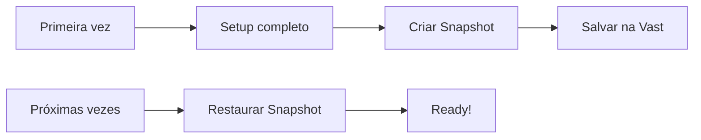

# Estratégias de Deploy GPU

Comparativo completo de estratégias para deploy de workloads GPU em clouds como Vast.ai.

## Visão Geral das Estratégias

| ID | Estratégia | Descrição |
|----|-----------|-----------|
| A | Docker Oficial Pronto | Usar imagens oficiais (ollama/ollama, pytorch/pytorch) |
| B | Docker Oficial + Script | Imagem oficial + instalar SSH/ferramentas via onstart |
| C | Docker Custom Publicado | Imagem personalizada no Docker Hub/Registry |
| D | Base + Cache Backblaze | Imagem base + baixar binários do Backblaze B2 |
| E | Base + Vast Snapshot | Restaurar de snapshot salvo na Vast.ai |
| F | Docker Custom + Snapshot | Imagem custom + snapshot para modelos/dados |

---

## Tabela Comparativa Principal

| Critério | A: Oficial | B: Oficial+Script | C: Custom | D: Cache B2 | E: Snapshot | F: Custom+Snap |
|----------|-----------|------------------|-----------|-------------|-------------|----------------|
| **Tempo 1ª vez** | 30-120s | 60-180s | 30-60s | 45-90s | 15-30s | 15-30s |
| **Tempo recorrente** | 30-120s | 60-180s | 30-60s | 30-60s | 15-30s | 15-30s |
| **Complexidade** | Baixa | Média | Alta | Alta | Média | Alta |
| **Custo infra** | Zero | Zero | Registry | B2 storage | Vast storage | Ambos |
| **Flexibilidade** | Baixa | Média | Alta | Alta | Baixa | Alta |
| **Manutenção** | Zero | Baixa | Média | Média | Baixa | Média |

---

## Análise por Stack

### Stack Ollama (LLMs locais)

| Estratégia | Imagem Base | Tempo Load | Prós | Contras |
|------------|-------------|------------|------|---------|
| A: ollama/ollama | 2GB | ~40s | Zero config | Sem SSH nativo |
| B: ollama + SSH script | 2GB | ~80s | SSH funcional | +40s para instalar SSH |
| C: Custom ollama+SSH | 2.5GB | ~50s | Tudo pronto | Manter imagem |
| E: Snapshot completo | N/A | ~20s | Ultra rápido | Custo storage |

**Recomendação Ollama**: Estratégia **B** (ollama/ollama + SSH script) para balance entre simplicidade e funcionalidade.

### Stack PyTorch (ML/Training)

| Estratégia | Imagem Base | Tempo Load | Prós | Contras |
|------------|-------------|------------|------|---------|
| A: pytorch/pytorch | 3-4GB | ~60s | CUDA incluído | Grande |
| B: pytorch + SSH | 3-4GB | ~90s | Completo | +30s script |
| D: cuda-base + cache | 200MB | ~45s | Ultra leve | Setup complexo |
| F: Custom + snapshot | 3GB | ~25s | Rápido + flexível | Custo duplo |

**Recomendação PyTorch**: Estratégia **D** (cuda-base + cache B2) para velocidade, ou **A** para simplicidade.

### Stack vLLM (Inference Server)

| Estratégia | Imagem Base | Tempo Load | Prós | Contras |
|------------|-------------|------------|------|---------|
| A: vllm/vllm-openai | 8GB+ | ~180s | API pronta | Muito pesado |
| C: Custom otimizado | 4GB | ~90s | Otimizado | Manutenção |
| F: Custom + snapshot modelos | 4GB | ~40s | Modelos prontos | Custo storage |

**Recomendação vLLM**: Estratégia **F** para produção, **A** para testes rápidos.

---

## Detalhamento das Estratégias

### A: Docker Oficial Pronto


**Prós:**
- Zero configuração
- Sempre atualizado
- Suporte oficial

**Contras:**
- Sem personalização
- Pode faltar SSH
- Dependente do maintainer

**Imagens recomendadas:**
```
ollama/ollama          # ~2GB, sem SSH
pytorch/pytorch        # ~3-4GB, sem SSH
nvidia/cuda:12.1-base  # ~200MB, minimal
```

### B: Docker Oficial + Script Onstart


**Script exemplo (onstart.sh):**
```bash
#!/bin/bash
# Instalar SSH em imagem que não tem
apt-get update && apt-get install -y openssh-server
mkdir -p /run/sshd
echo 'root:${CONTAINER_PASSWORD}' | chpasswd
/usr/sbin/sshd -D &
```

**Prós:**
- Usa imagens oficiais leves
- Personalização flexível
- Sem manter registry

**Contras:**
- +30-60s no startup
- Script pode falhar
- Sem cache

### C: Docker Custom Publicado


**Dockerfile exemplo:**
```dockerfile
FROM ollama/ollama:latest

# Adicionar SSH
RUN apt-get update && apt-get install -y openssh-server \
    && mkdir -p /run/sshd

# Configurar entrypoint
COPY entrypoint.sh /entrypoint.sh
RUN chmod +x /entrypoint.sh
ENTRYPOINT ["/entrypoint.sh"]
```

**Prós:**
- Controle total
- Startup rápido
- Reproduzível

**Contras:**
- Manter registry (Docker Hub, GHCR)
- Rebuild para updates
- Custo de storage

### D: Base + Cache Backblaze


**Script de cache:**
```bash
#!/bin/bash
# Baixar binários pré-compilados do B2
B2_BUCKET="dumont-cache"
B2_FILE="pytorch-2.1.0-cu121.tar.gz"

# Download e extração
rclone copy b2:$B2_BUCKET/$B2_FILE /tmp/
tar -xzf /tmp/$B2_FILE -C /opt/
```

**Prós:**
- Imagem base ultra leve (~200MB)
- Cache controlado
- Versionamento de binários

**Contras:**
- Setup complexo (rclone, B2)
- Custo B2 por download
- Manutenção do cache

**Custo B2:**
- Storage: $0.005/GB/mês
- Download: $0.01/GB
- Upload: Grátis

### E: Base + Vast Snapshot



**Prós:**
- Startup ultra rápido (~15-30s)
- Estado exato preservado
- Modelos já baixados

**Contras:**
- Custo storage Vast.ai
- Snapshot desatualiza
- Locked to Vast.ai

**Custo Snapshot Vast.ai:**
- ~$0.05-0.10/GB/mês (varia por host)

### F: Docker Custom + Snapshot

Combina o melhor dos dois mundos:
- Docker custom para a stack base (PyTorch, vLLM, etc.)
- Snapshot para modelos grandes e dados


**Prós:**
- Máxima velocidade
- Stack atualizada (rebuild docker)
- Modelos preservados (snapshot)

**Contras:**
- Maior complexidade
- Custo duplo (registry + snapshot)
- Sincronização manual

---

## Matriz de Decisão

### Por Prioridade

| Se você prioriza... | Use estratégia |
|---------------------|----------------|
| Simplicidade | A (Oficial) |
| Velocidade + Simplicidade | B (Oficial + Script) |
| Controle total | C (Custom) |
| Custo mínimo | D (Base + B2 Cache) |
| Velocidade máxima | E (Snapshot) |
| Produção enterprise | F (Custom + Snapshot) |

### Por Caso de Uso

| Caso de Uso | Estratégia Recomendada |
|-------------|----------------------|
| Desenvolvimento/teste | A ou B |
| CI/CD pipelines | C |
| Training jobs frequentes | D ou E |
| Inference produção | F |
| Demos/POCs | A |
| Multi-cloud | C ou D |

---

## Implementação no DumontCloud

### Configuração deploy_wizard.py

```python
DOCKER_IMAGES = {
    # ULTRA RAPIDAS (< 30s) - Sem PyTorch
    "cuda-base": "nvidia/cuda:12.1.0-base-ubuntu22.04",      # ~200MB
    "cuda-runtime": "nvidia/cuda:12.1.0-runtime-ubuntu22.04", # ~1.5GB
    "ollama": "ollama/ollama",                                # ~2GB

    # RAPIDAS (30-60s) - Com PyTorch otimizado
    "pytorch": "pytorch/pytorch:2.1.0-cuda12.1-cudnn8-runtime", # ~3GB

    # MEDIAS (60-120s) - PyTorch + SSH pronto
    "vastai-pytorch": "vastai/pytorch",                       # ~4-5GB

    # LENTAS (>120s) - Pesadas mas completas
    "vastai": "vastai/base-image",                            # ~8GB
}
```

### Script SSH Install (para estratégia B)

```bash
#!/bin/bash
# /opt/dumont/install_ssh.sh

set -e

# Verificar se SSH já está instalado
if command -v sshd &> /dev/null; then
    echo "SSH já instalado"
    exit 0
fi

# Instalar SSH
apt-get update
apt-get install -y --no-install-recommends openssh-server

# Configurar
mkdir -p /run/sshd
sed -i 's/#PermitRootLogin prohibit-password/PermitRootLogin yes/' /etc/ssh/sshd_config

# Iniciar
/usr/sbin/sshd

echo "SSH instalado e rodando"
```

---

## Benchmarks Reais

Testes realizados em RTX 4090, conexão 1Gbps:

| Imagem | Tamanho | Pull Time | Total Ready |
|--------|---------|-----------|-------------|
| nvidia/cuda:12.1-base | 200MB | ~5s | ~10s |
| ollama/ollama | 2GB | ~25s | ~30s |
| pytorch/pytorch | 3.5GB | ~45s | ~55s |
| vastai/pytorch | 5GB | ~65s | ~80s |
| vastai/base-image | 8GB | ~120s | ~150s |

**Com SSH script adicional:** +30-45s

**Com Snapshot restore:** 15-25s (independente do tamanho original)

---

## Conclusão

Para o DumontCloud, recomendamos:

1. **Default**: Estratégia **B** (ollama/ollama + SSH script)
   - Balance entre velocidade e simplicidade
   - ~80s para estar pronto
   - Zero custo adicional

2. **Power users**: Estratégia **E** (Snapshots)
   - Para quem usa frequentemente
   - ~20s para estar pronto
   - Custo de storage vale a pena

3. **Enterprise**: Estratégia **F** (Custom + Snapshot)
   - Máximo controle e velocidade
   - Requer mais manutenção
   - Ideal para produção
