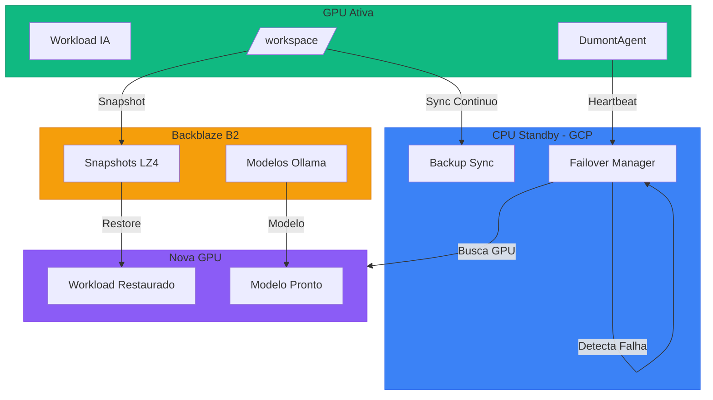
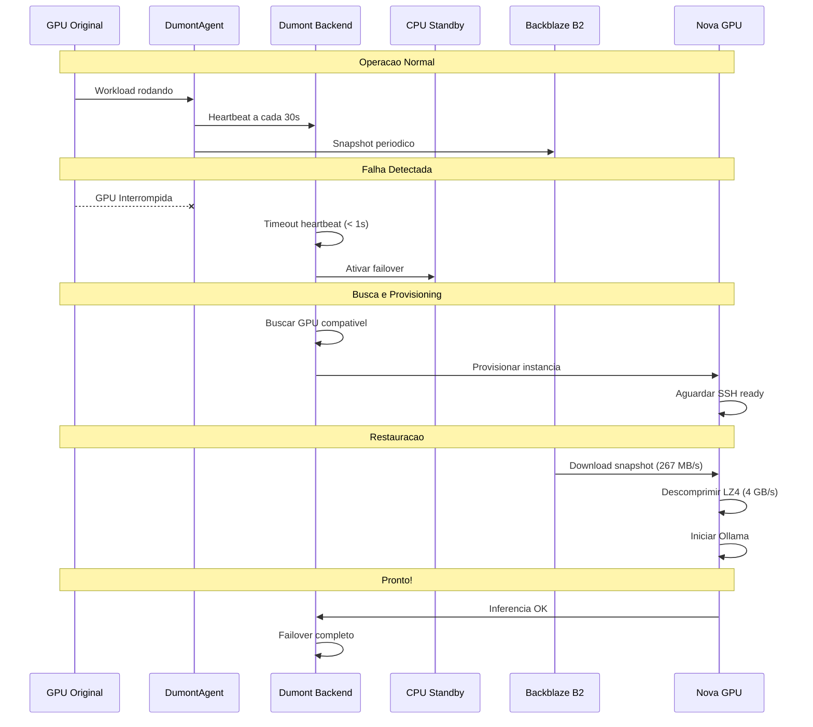
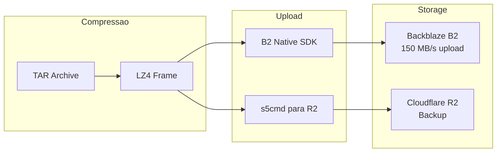
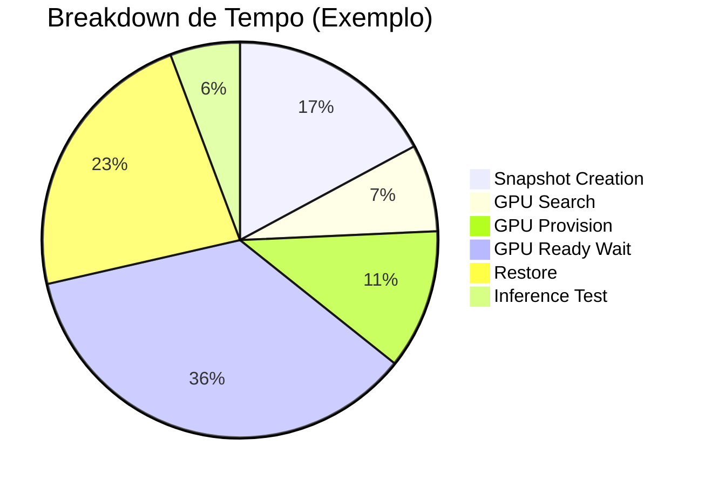

# Sistema de Failover - Dumont Cloud

## Visao Geral

O sistema de failover do Dumont Cloud garante **alta disponibilidade** para cargas de trabalho de IA em GPUs spot. Quando uma GPU e interrompida (spot preemption, falha de hardware, etc), o sistema automaticamente:

1. Detecta a falha em < 1 segundo
2. Migra para CPU Standby enquanto busca nova GPU
3. Provisiona nova GPU automaticamente
4. Restaura dados do snapshot Backblaze B2
5. Retoma inferencia em < 60 segundos

## Arquitetura



## Fluxo de Failover



## Fases do Failover

| Fase | Descricao | Tempo Tipico |
|------|-----------|--------------|
| **Deteccao** | Detectar falha via timeout de heartbeat | < 1s |
| **Busca GPU** | Encontrar GPU compativel na Vast.ai | 2-5s |
| **Provisioning** | Criar nova instancia | 30-60s |
| **SSH Ready** | Aguardar instancia estar acessivel | 30-120s |
| **Restore** | Baixar e descomprimir snapshot do B2 | 10-30s |
| **Inference** | Iniciar Ollama e verificar modelo | 5-15s |
| **TOTAL** | Tempo total de recuperacao (MTTR) | 60-120s |

## Tecnologias Utilizadas

### Snapshot e Storage



**Velocidades:**
- Upload para B2: ~150 MB/s
- Download do B2: ~267 MB/s
- Descompressao LZ4: ~4 GB/s

### Infraestrutura

| Componente | Tecnologia | Funcao |
|------------|------------|--------|
| GPU Provider | Vast.ai | GPUs spot/on-demand |
| CPU Standby | GCP e2-medium | Backup durante failover |
| Storage | Backblaze B2 | Snapshots comprimidos |
| Database | PostgreSQL | Historico e metricas |
| Backend | FastAPI | Orquestracao |
| Agent | DumontAgent | Sync e monitoramento |

## API Endpoints

### Teste de Failover Simulado (Rapido)

```bash
# Criar associacao mock para teste
dumont failover test-setup gpu_instance_id=12345

# Simular failover (sem criar recursos reais)
dumont failover simulate 12345

# Ver status
dumont failover status abc123

# Relatorio
dumont failover report
```

### Teste de Failover Real (Com Snapshots B2)

```bash
# Teste completo com snapshot real
dumont failover test-real 12345

# Com modelo especifico
dumont failover test-real 12345 model=qwen2.5:0.5b

# Ver relatorio detalhado
dumont failover test-real-report real-abc123

# Historico de todos os testes
dumont failover test-real-history
```

### Endpoints REST

| Metodo | Endpoint | Descricao |
|--------|----------|-----------|
| POST | `/api/standby/failover/simulate/{gpu_id}` | Simular failover (rapido) |
| GET | `/api/standby/failover/status/{id}` | Status do failover |
| GET | `/api/standby/failover/report` | Relatorio de metricas |
| POST | `/api/standby/failover/test-real/{gpu_id}` | Teste real com B2 |
| GET | `/api/standby/failover/test-real/report/{id}` | Relatorio detalhado |
| GET | `/api/standby/failover/test-real/history` | Historico de testes |

## Metricas Coletadas

### Teste Real de Failover



**Metricas persistidas no PostgreSQL:**

```python
class FailoverTestEvent:
    # Identificacao
    failover_id: str
    gpu_instance_id: int
    user_id: str

    # Snapshot
    snapshot_id: str
    snapshot_size_bytes: int
    snapshot_creation_time_ms: int
    snapshot_compression: str  # "lz4"
    snapshot_storage: str      # "backblaze_b2"

    # Restore
    restore_time_ms: int
    restore_download_time_ms: int
    restore_decompress_time_ms: int

    # Inference
    inference_model: str
    inference_ready_time_ms: int
    inference_success: bool

    # Total
    total_time_ms: int
    success: bool
```

## Visualizacao no Dashboard

O componente `FailoverReport.jsx` exibe:

1. **Resumo Executivo**
   - MTTR (Mean Time To Recovery)
   - Taxa de sucesso
   - Total de failovers

2. **Breakdown Visual de Tempos**
   - Barra colorida mostrando % de cada fase
   - Tempos individuais por fase

3. **Detalhes do Snapshot**
   - Tamanho (MB)
   - Tempo de criacao
   - Storage (B2/R2)
   - Compressao (LZ4)

4. **Teste de Inferencia**
   - Modelo usado
   - Tempo ate resposta
   - Status (PASSED/FAILED)

5. **Historico**
   - Lista de todos os testes
   - Filtros por periodo
   - Detalhes expandiveis

## Configuracao

### Variaveis de Ambiente

```bash
# Backblaze B2
B2_ENDPOINT=https://s3.us-west-004.backblazeb2.com
B2_BUCKET=dumont-snapshots
B2_KEY_ID=your-key-id
B2_APPLICATION_KEY=your-app-key

# GCP (CPU Standby)
GOOGLE_APPLICATION_CREDENTIALS=/path/to/credentials.json
GCP_PROJECT_ID=your-project
GCP_ZONE=europe-west1-b

# Vast.ai
VAST_API_KEY=your-vast-api-key
```

### Configuracao de Auto-Standby

```bash
# Habilitar CPU Standby automatico
dumont standby configure enabled=true gcp_zone=europe-west1-b

# Verificar status
dumont standby status
```

## Custos Estimados

| Componente | Custo Mensal |
|------------|--------------|
| CPU Standby (e2-medium spot) | ~$7/mes |
| Backblaze B2 (100GB) | ~$0.50/mes |
| Transferencia B2 | Gratis ate 3x storage |
| Nova GPU (apenas quando necessario) | Variavel |

**Total estimado para manter failover pronto: ~$10/mes**

## Proximos Passos

1. [ ] Implementar failover multi-regiao
2. [ ] Adicionar suporte a checkpoints de treinamento
3. [ ] Dashboard de monitoramento em tempo real
4. [ ] Alertas via Slack/Discord
5. [ ] Metricas no Prometheus/Grafana

## FAQ

**Q: Quanto tempo demora um failover completo?**
A: Entre 60-120 segundos, dependendo do tamanho dos dados.

**Q: Os dados sao perdidos durante o failover?**
A: Nao, os dados sao restaurados do ultimo snapshot. Snapshots sao criados a cada 30 segundos por padrao.

**Q: Qual e o custo do sistema de failover?**
A: Aproximadamente $10/mes para manter o CPU Standby + storage.

**Q: Posso testar o failover sem destruir minha GPU?**
A: Sim! Use `dumont failover test-real <gpu_id>` - ele mantem a GPU original rodando.
