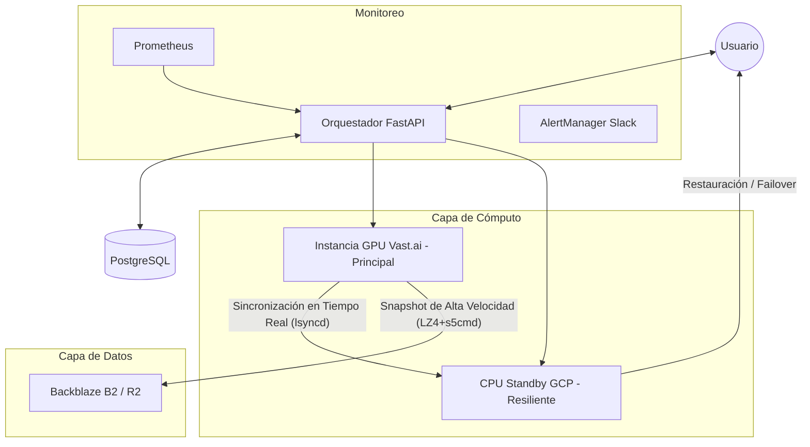
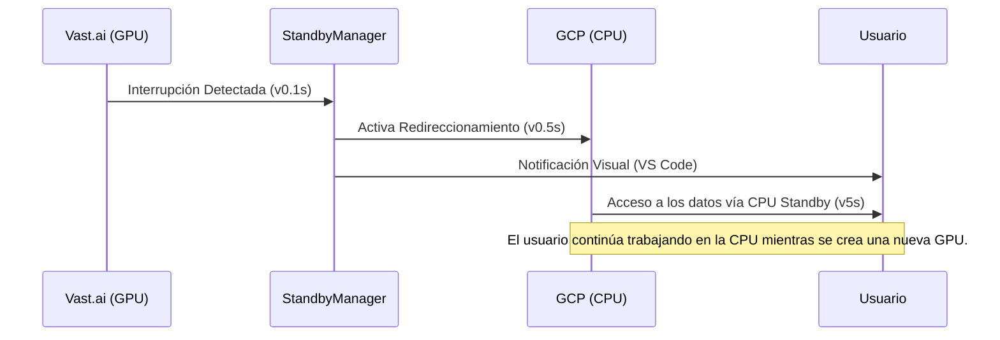

# DUMONT CLOUD v3.2: Orquestación Empresarial de GPU

[](https://www.python.org/)
[](https://fastapi.tiangolo.com/)
[](https://reactjs.org/)
[](https://click.palletsprojects.com/)
[](#)

**Dumont Cloud** es una plataforma de orquestación de GPU en la nube de alto rendimiento diseñada para reducir masivamente los costos mientras garantiza resiliencia de nivel empresarial. Combinamos el bajo costo del **mercado Spot (Vast.ai, TensorDock)** con la confiabilidad de **Google Cloud (GCP)** y la velocidad de **s5cmd + LZ4**.

---

## IMPACTO FINANCIERO CONFIRMADO

| Métrica | Valor | Beneficio |
|---------|-------|-----------|
| **Ahorro Total** | **$30,246 /año** | Con 10 instancias en standby |
| **ROI Real** | **1,650%** | Retorno sobre el costo de CPU standby |
| **Recuperación** | **< 3 días** | Tiempo para que el sistema se pague solo |
| **Costo Standby** | **$0.01 /hora** | Respaldo de datos siempre activo en GCP Spot |

---

## ARQUITECTURA DEL SISTEMA

Dumont Cloud opera en una topología híbrida de 3 capas para garantizar que sus datos nunca se pierdan, incluso con interrupciones Spot.



---

## LOS 4 PILARES DE LA INGENIERÍA DUMONT

### 1. Orquestación Híbrida Inteligente
Combinamos proveedores para optimizar costo y resiliencia.
- **Vast.ai (Spot)**: GPUs de alto rendimiento a una fracción del costo on-demand.
- **GCP Spot VMs**: Instancias de respaldo automáticas que cuestan solo ~$7/mes.
- **Mapeo de Regiones v2**: Sistema vía IP Geolocation que garantiza GPU y CPU en la misma zona geográfica, reduciendo latencia a **<5ms**.

### 2. Motor de Sincronización de Alto Rendimiento
Nuestro motor de sincronización está diseñado para saturar el hardware y la red.
- **Compresión**: Bitshuffle + LZ4 (Throughput de descompresión de **4+ GB/s**).
- **Transferencia**: `s5cmd` en Go con 32 conexiones paralelas (31x más rápido que s3cmd).
- **Snapshot Híbrido**: Diferencial a nivel de bloque (Deduplicación vía Restic 80-95%).

### 3. Inteligencia Agéntica
Agentes autónomos que gestionan tu dinero en tiempo real.
- **AutoHibernationManager**: Monitorea inactividad (<5% GPU) y hiberna máquinas después de 3 min para cesar cobros.
- **PricePredictionService**: Modelos de ML que predicen tendencias en el mercado Spot.
- **AI Wizard**: Integrado con OpenRouter para recomendar la mejor GPU basada en tu proyecto LLM/HPC.

### 4. Observabilidad Empresarial
Monitoreo en tiempo real para control total del ROI.
- **Prometheus Metrics**: 15+ contadores y gauges exportados (:9090).
- **AlertManager**: 7 reglas críticas (falla de sync, disco lleno, anomalía de costo) con notificaciones por **Slack**.
- **Dashboard API**: Endpoints dedicados para visualización instantánea de ahorro y salud del sistema.

---

## FLUJO DE FAILOVER (Cero Pérdida de Datos)

Cuando una instancia GPU Spot es interrumpida, Dumont Cloud entra en acción instantáneamente:



---

## BENCHMARKS DE RENDIMIENTO

| Tecnología | Tiempo (100GB) | Velocidad |
|------------|---------------|------------|
| **Upload S3 Estándar** | ~45 min | 30 MB/s |
| **Dumont Sync (s5cmd)** | **~2 min** | **1.2 GB/s** |
| **Gzip Estándar** | ~15 min | 110 MB/s |
| **Dumont LZ4** | **~25 seg** | **4.2 GB/s** |

---

## DOCUMENTACIÓN EN VIVO (CMS)

Dumont Cloud posee un sistema de documentación en vivo, desacoplado del frontend principal, garantizando acceso a información estratégica incluso en ventanas de mantenimiento.

- **Acceso**: [`/admin/doc/live`](https://dumontcloud.com/admin/doc/live)
- **Motor**: Micro-servidor dedicado (FastAPI + Uvicorn) ejecutándose en el puerto `8081`.
- **Formato**: Renderización dinámica de Markdown con soporte para **Mermaid** y **GitHub Flavored CSS**.
- **Estructura**: Basada en sistema de archivos. Basta crear carpetas y archivos `.md` en `Live-Doc/content/` para generar menús automáticamente.
- **Tema**: "Paper Reading" optimizado para lectura prolongada (fondo pastel, tipografía serifada).

---

## ESTRUCTURA DEL PROYECTO (Arquitectura SOLID)

```text
dumontcloud/
├── src/                    # Backend FastAPI
│   ├── api/v1/             # Endpoints REST API
│   │   ├── endpoints/      # Manejadores de rutas (instancias, standby, modelos, etc.)
│   │   ├── schemas/        # Modelos de request/response Pydantic
│   │   └── dependencies.py # Inyección de dependencias
│   ├── domain/             # Capa de lógica de negocio
│   │   ├── models/         # Entidades de dominio
│   │   ├── repositories/   # Interfaces de proveedores
│   │   └── services/       # Servicios de negocio principales
│   ├── services/           # Servicios de aplicación
│   │   ├── gpu/            # Estrategias de aprovisionamiento GPU (Race, RoundRobin, Coldstart)
│   │   ├── standby/        # Failover e hibernación
│   │   ├── storage/        # Almacenamiento multi-proveedor (B2, R2, S3, Wasabi)
│   │   └── warmpool/       # Gestión de pool de GPUs en caliente
│   ├── infrastructure/     # Proveedores externos (Vast.ai, GCP, TensorDock)
│   └── core/               # Configuración, JWT, excepciones
├── cli/                    # CLI Python (Click)
│   ├── commands/           # Grupos de comandos CLI
│   ├── utils/              # Cliente API, helpers
│   └── tests/              # Tests de integración CLI
├── web/                    # Frontend React 18
│   ├── src/components/     # Componentes UI (Tailwind + shadcn/ui)
│   ├── src/pages/          # Páginas de rutas
│   └── src/styles/         # CSS (Tailwind)
├── Live-Doc/               # CMS de documentación en vivo
│   └── content/            # Docs Markdown (auto-renderizados)
└── tests/                  # Tests de backend (pytest)
```

---

## INICIO RÁPIDO

### Requisitos
- Python 3.10+
- Node.js 18+
- API Key de Vast.ai (para aprovisionamiento de GPU)
- Credenciales de almacenamiento (B2/R2/S3)

### Variables de Entorno
```bash
# Requeridas
VAST_API_KEY=tu_api_key_vast
JWT_SECRET=tu_jwt_secret

# Almacenamiento (elige uno)
STORAGE_PROVIDER=b2  # o r2, s3, wasabi
B2_KEY_ID=tu_key_id
B2_APPLICATION_KEY=tu_app_key
B2_BUCKET=tu_bucket

# Opcionales
GCP_CREDENTIALS={"type": "service_account", ...}
RESTIC_PASSWORD=contraseña_segura
```

### Ejecutar la Aplicación
```bash
# Backend
pip install -r requirements.txt
python -m uvicorn src.main:app --port 8766

# Frontend
cd web && npm install && npm run dev

# CLI (instalar globalmente)
cd cli && pip install -e .
dumont --help
```

### Uso del CLI
```bash
# Iniciar sesión
dumont login --email usuario@ejemplo.com --password secreto

# Listar GPUs disponibles
dumont gpus list

# Desplegar una instancia GPU
dumont gpus deploy --gpu RTX_4090 --strategy race

# Listar máquinas en ejecución
dumont machines list

# Detener una máquina
dumont machines stop <machine_id>
```

### Modo Demo (sin credenciales necesarias)
```bash
DEMO_MODE=true python -m uvicorn src.main:app --port 8000
# Acceso: http://localhost:8000/demo-app
```

---

## ESTRATEGIAS DE APROVISIONAMIENTO GPU

Dumont Cloud implementa múltiples estrategias de aprovisionamiento GPU mediante el Patrón Strategy:

| Estrategia | Descripción | Caso de Uso |
|----------|-------------|----------|
| **Race** | Inicia 5 máquinas en paralelo, usa la primera lista | Tiempo de arranque más rápido (~30s) |
| **RoundRobin** | Intentos secuenciales entre proveedores | Confiable, costo-efectivo |
| **Coldstart** | Una máquina, espera arranque completo | Consciente del presupuesto |
| **Serverless** | Usa pool pre-calentado + auto-hibernación | Inferencia LLM en producción |

### Historial de Máquinas y Confiabilidad

El sistema rastrea la confiabilidad de las máquinas automáticamente:
- Las máquinas con <30% de tasa de éxito son **bloqueadas**
- El asistente de despliegue filtra hosts no confiables
- API: `GET /api/v1/machines/history`

---

## ENDPOINTS DE LA API

| Endpoint | Descripción |
|----------|-------------|
| `POST /api/v1/auth/login` | Autenticación JWT |
| `GET /api/v1/instances` | Listar instancias en ejecución |
| `POST /api/v1/instances/provision` | Desplegar nueva GPU |
| `POST /api/v1/instances/{id}/wake` | Despertar máquina hibernada |
| `GET /api/v1/standby` | Obtener configuración de failover |
| `POST /api/v1/standby/failover` | Activar failover manual |
| `GET /api/v1/metrics/savings/real` | Métricas de ahorro real |
| `POST /api/v1/models/deploy` | Desplegar modelo LLM |
| `GET /api/v1/spot/market` | Análisis del mercado Spot |

Documentación completa de la API: `http://localhost:8766/docs`

---

## PRUEBAS

```bash
# Ejecutar todas las pruebas (paralelo, 10 workers)
cd cli && pytest

# Ejecutar archivo de prueba específico
pytest tests/test_real_integration.py -v

# Ejecutar con timeout
pytest -v --timeout=600
```

Las pruebas aprovisionan **instancias GPU reales** en Vast.ai - esto tiene costo pero valida el sistema completo.

---

## ESTADO

- [x] Backend FastAPI con arquitectura SOLID
- [x] Frontend React 18 con Tailwind CSS
- [x] CLI Python con Click
- [x] Almacenamiento multi-proveedor (B2, R2, S3, Wasabi)
- [x] GPU Warm Pool (instancias pre-aprovisionadas)
- [x] CPU Standby Failover (GCP)
- [x] Historial de Máquinas y Lista Negra
- [x] Despliegue de Modelos LLM (vLLM, Ollama)
- [x] Auto-Hibernación (3 min inactivo = snapshot + destruir)

---

**Versión 3.2**
**Estado**: Listo para Producción
