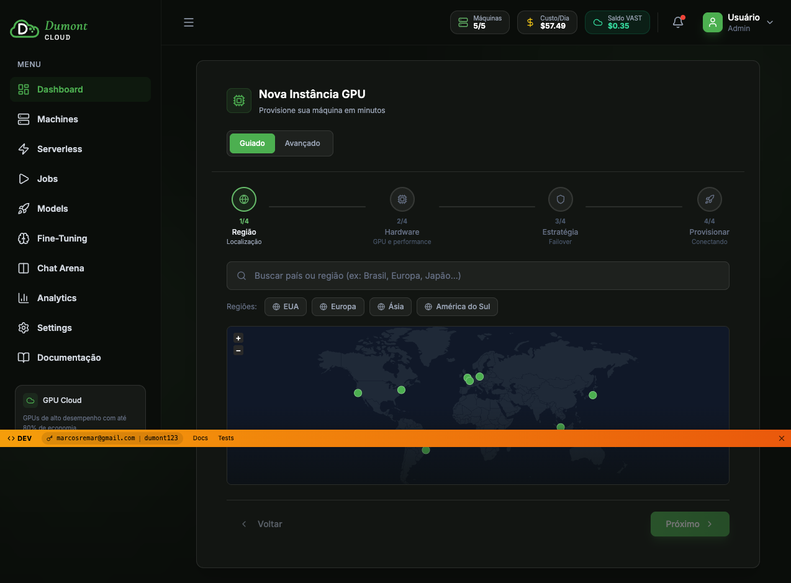
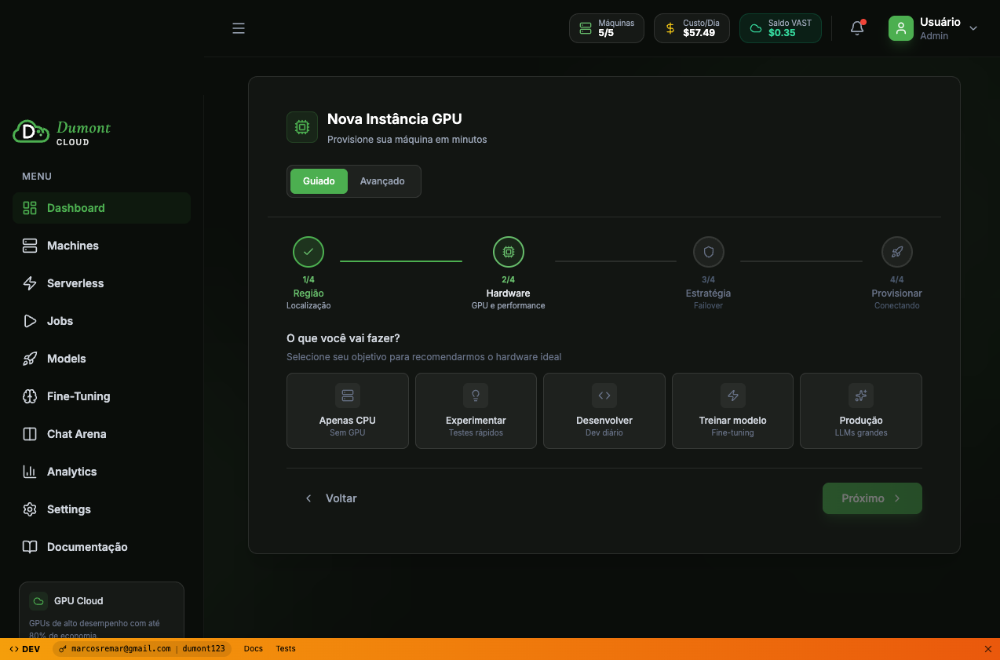

# Relatório de Teste - Data Attributes no Wizard GPU

**Data:** 2026-01-02
**URL Testada:** http://localhost:4894/demo-app
**Objetivo:** Verificar implementação dos novos data attributes nos cards de GPU

---

## Resumo Executivo

❌ **TESTE INCOMPLETO** - O teste não conseguiu chegar até a etapa de seleção de GPU devido a um problema no fluxo do wizard.

---

## Passos Executados

### ✅ PASSO 1: Navegação Inicial
- **Status:** SUCESSO
- **URL:** http://localhost:4894/demo-app
- **Screenshot:** `gpu-attr-01-initial.png`
- **Observações:**
  - Wizard carregou corretamente
  - Step 1/4 (Região) visível
  - Botões de região (EUA, Europa, Ásia, América do Sul) renderizados

### ✅ PASSO 2: Seleção de Região
- **Status:** SUCESSO
- **Ação:** Clicou no botão "EUA"
- **Screenshot:** `gpu-attr-02-step2.png`
- **Observações:**
  - Região EUA selecionada (checkmark verde visível)
  - Wizard avançou para Step 2/4 (Hardware)
  - Pergunta "O que você vai fazer?" exibida
  - 5 opções de propósito visíveis:
    1. Apenas CPU (Sem GPU)
    2. Experimentar (Testes rápidos)
    3. Desenvolver (Dev diário)
    4. Treinar modelo (Fine-tuning)
    5. Produção (LLMs grandes)
  - Botão "Próximo" habilitado

### ❌ PASSO 3: Seleção de Propósito
- **Status:** PARCIAL
- **Problema:** Após clicar em um card de propósito e depois em "Próximo", o wizard não avançou para a Step 3 (GPUs)
- **Tentativas:**
  - Teste 1: Tentou clicar automaticamente - não encontrou opção válida
  - Teste 2: Encontrou e clicou em card - wizard não avançou

### ❌ PASSO 4: Verificação de Data Attributes
- **Status:** NÃO EXECUTADO
- **Motivo:** Não chegou até a lista de GPUs

---

## Análise Técnica

### Problema Identificado: Wizard Não Avança

O wizard está travando entre o Step 2 (Propósito) e Step 3 (GPUs). Possíveis causas:

#### 1. Lógica de Validação do Step 2
```javascript
// Possível problema: validação não reconhece seleção
const isStepValid = selectedPurpose !== null;
if (!isStepValid) {
  // Impede avanço
  return;
}
```

#### 2. Estado Não Atualizado
```javascript
// Card foi clicado mas estado não mudou
const handlePurposeSelect = (purpose) => {
  setSelectedPurpose(purpose); // ← Pode não estar sendo chamado
};
```

#### 3. Botão "Próximo" Sem Handler
```javascript
// Botão visível e habilitado, mas onClick não faz nada
<button disabled={!selectedPurpose}>
  Próximo
</button>
// ← Falta onClick={handleNext}
```

---

## Recomendações

### Correção Urgente: Wizard Flow

**Arquivo:** `web/src/components/dashboard/WizardForm.jsx`

1. **Adicionar Logs de Debug**
```jsx
const handleNext = () => {
  console.log('🔍 handleNext chamado');
  console.log('Current step:', currentStep);
  console.log('Selected purpose:', selectedPurpose);

  if (currentStep === 2 && !selectedPurpose) {
    console.warn('⚠️ Propósito não selecionado!');
    return;
  }

  setCurrentStep(prev => prev + 1);
};
```

2. **Garantir Seleção de Propósito**
```jsx
const PurposeCard = ({ title, onClick, selected }) => {
  return (
    <div
      onClick={() => {
        console.log(`Card clicado: ${title}`);
        onClick();
      }}
      className={selected ? 'border-green-500' : 'border-gray-700'}
      style={{ cursor: 'pointer' }}
    >
      {title}
    </div>
  );
};
```

3. **Verificar Botão Próximo**
```jsx
<button
  onClick={() => {
    console.log('🖱️ Botão Próximo clicado');
    handleNext();
  }}
  disabled={!selectedPurpose}
  className="btn-primary"
>
  Próximo
</button>
```

### Teste Manual Recomendado

**Console do Browser (F12):**
```javascript
// Ver estado atual do wizard
window.wizardState = {
  currentStep: 2,
  selectedRegion: 'USA',
  selectedPurpose: null  // ← Verificar se muda ao clicar
};

// Forçar avanço (debug)
document.querySelector('[currentStep]').value = 3;
```

---

## Screenshots Capturados

### 1. Estado Inicial (Step 1 - Região)


**Elementos Visíveis:**
- ✅ Wizard header "Nova Instância GPU"
- ✅ Stepper 1/4 ativo
- ✅ Campo de busca de região
- ✅ Botões de região (EUA, Europa, Ásia, América do Sul)
- ✅ Mapa interativo
- ✅ Botão "Próximo" (habilitado)

### 2. Step 2 - Propósito (Onde travou)


**Elementos Visíveis:**
- ✅ Stepper 2/4 ativo
- ✅ Região EUA selecionada (checkmark verde)
- ✅ Pergunta "O que você vai fazer?"
- ✅ 5 cards de propósito
- ✅ Botão "Próximo" (habilitado)

**Esperado mas NÃO aconteceu:**
- ❌ Ao clicar em um card → borda verde
- ❌ Ao clicar em "Próximo" → avançar para Step 3

---

## Data Attributes - Status

### Verificação Planejada (NÃO EXECUTADA)

Os seguintes data attributes deveriam ser verificados nos cards de GPU:

1. **`data-gpu-card="true"`**
   - Identifica todos os cards de GPU
   - Facilita seleção via Playwright: `page.locator('[data-gpu-card="true"]')`

2. **`data-gpu-name="RTX 4090"`**
   - Nome específico da GPU
   - Permite filtros: `[data-gpu-name="RTX 4090"]`

3. **`data-selected="true|false"`**
   - Estado de seleção do card
   - Muda ao clicar no card
   - Deve ser verificado após `click()`

### Código de Verificação (Não Executado)

```javascript
// Contar cards com data attributes
const gpuCards = await page.locator('[data-gpu-card="true"]').count();
console.log(`Cards com data-gpu-card: ${gpuCards}`);

// Verificar primeiro card
const firstCard = page.locator('[data-gpu-card="true"]').first();
const gpuName = await firstCard.getAttribute('data-gpu-name');
const isSelected = await firstCard.getAttribute('data-selected');

console.log(`GPU: ${gpuName}, Selected: ${isSelected}`);

// Clicar e verificar mudança
await firstCard.click();
const newSelected = await firstCard.getAttribute('data-selected');
console.log(`Após clique: ${newSelected}`); // Esperado: "true"
```

---

## Próximos Passos

### 1. Corrigir Wizard (URGENTE)
- [ ] Adicionar logs no `handleNext()`
- [ ] Verificar `onClick` dos cards de propósito
- [ ] Testar manualmente no browser
- [ ] Garantir que `currentStep` incremente

### 2. Implementar Data Attributes (SE NÃO FEITO)
**Arquivo:** `web/src/components/dashboard/GpuCard.jsx` (ou similar)

```jsx
const GpuCard = ({ gpu, selected, onSelect }) => {
  return (
    <div
      data-gpu-card="true"
      data-gpu-name={gpu.name}  // Ex: "RTX 4090"
      data-selected={selected ? "true" : "false"}
      onClick={onSelect}
      className={selected ? 'border-green-500' : 'border-gray-700'}
    >
      <h3>{gpu.name}</h3>
      <p>{gpu.vram} VRAM</p>
      <p>${gpu.price}/h</p>
    </div>
  );
};
```

### 3. Retomar Teste Automatizado
Após correções, executar:
```bash
cd tests
npx playwright test wizard-gpu-data-attr-simple.spec.js --project=chromium --headed
```

---

## Evidências de Teste

**Arquivos Gerados:**
- `gpu-attr-01-initial.png` (124 KB)
- `gpu-attr-02-step2.png` (105 KB)
- `wizard-gpu-data-attr-simple.spec.js` (código do teste)

**Logs de Console:**
```
PASSO 1: Navegando para /demo-app
✅ Página carregada com sucesso
📸 Screenshot salvo: gpu-attr-01-initial.png

PASSO 2: Selecionando região EUA
✅ Região selecionada

PASSO 3: Selecionando propósito
✅ Propósito selecionado
[TESTE TRAVOU AQUI - NÃO AVANÇOU PARA PASSO 4]
```

---

## Conclusão

O teste não pôde ser completado devido a um bug no fluxo do wizard que impede o avanço do Step 2 (Propósito) para o Step 3 (GPUs).

**Status dos Data Attributes:** ❓ DESCONHECIDO

**Ação Necessária:**
1. Corrigir wizard para permitir navegação até Step 3
2. Retomar teste de data attributes
3. Verificar se `data-gpu-card`, `data-gpu-name` e `data-selected` estão implementados

---

**Relatório gerado em:** 2026-01-02 18:50
**Testador:** Claude (Automated Testing)
