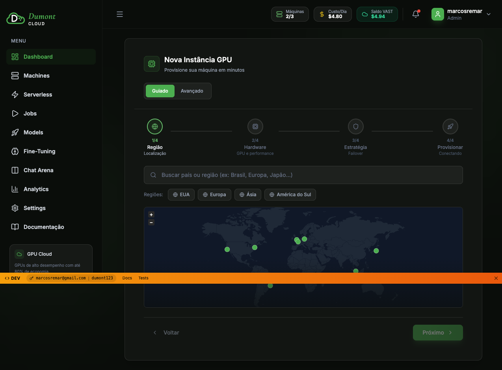
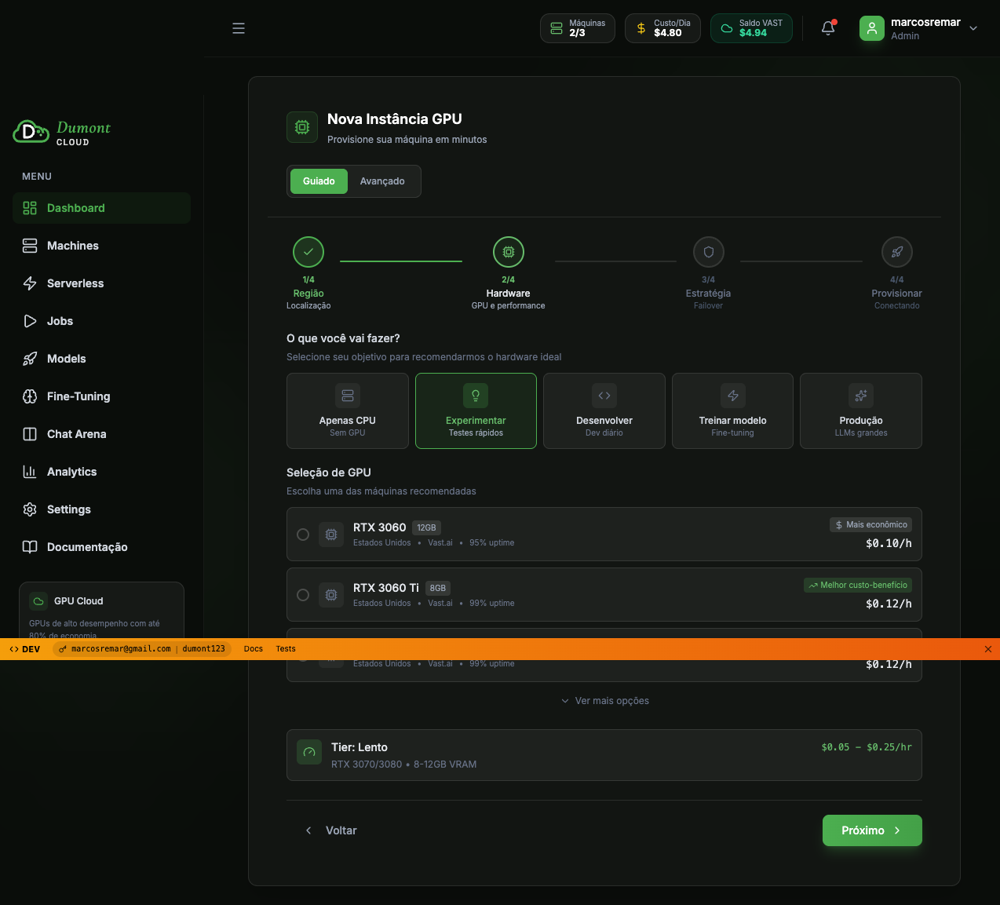

# Wizard Visual Test - Final Report

**Date**: 2026-01-02
**URL Tested**: http://localhost:4896/login?auto_login=demo
**Test Files**:
- `/Users/marcos/CascadeProjects/dumontcloud/tests/wizard-hardware-visual.spec.ts`
- `/Users/marcos/CascadeProjects/dumontcloud/tests/wizard-inspect-console.spec.ts`

---

## Executive Summary

✅ **Wizard UI works correctly** - navigation, tier selection, and visual rendering all function properly.

❌ **Backend integration issue** - The wizard is operating in **demo mode** and NOT calling the real API.

---

## Test Results

### 1. Auto-Login ✅
- URL: `http://localhost:4896/login?auto_login=demo`
- Result: Successfully logged in and redirected to `/app` in **1480ms**
- Auth token: **NOT present** in localStorage

### 2. Wizard Navigation ✅
- Step 1 (Região): Displayed correctly with region buttons (EUA, Europa, Ásia)
- Step 2 (Hardware): Successfully navigated from Step 1 → Step 2
- UI rendering: All elements visible and interactive

### 3. Step 2 - Hardware Selection ✅

**What's displayed:**
- Step indicator: "2/4 Hardware - GPU e performance"
- Usage question: "O que você vai fazer?"
  - Options: Apenas CPU | Experimentar | Desempenho | Treinar modelo | Produção
  - Selected: "Experimentar" (green highlight)
- GPU Selection:
  - RTX 3060 (8GB) - $0.10/h
  - RTX 3060 Ti (8GB) - $0.12/h
  - RTX 4070 Ti (12GB) - $0.12/h
- Performance tier: "Tier: Lento"
  - Price range: $6.50 - $0.25/hr
- Navigation: "Voltar" (Back) and "Próximo" (Next) buttons

### 4. Screenshots Captured ✅
- `wizard-step1.png` - Region selection step
- `wizard-step2-hardware.png` - Hardware selection step
- `wizard-console-inspect.png` - Final state with console inspection

---

## Critical Findings

### ❌ Issue #1: Demo Mode Enabled
```
localStorage.getItem('demo_mode') = "true"
```

**Impact**: The wizard is showing static/demo data instead of fetching real GPU offers from VAST.ai API.

**Expected**: `demo_mode` should be `false` or not present when using real backend.

---

### ❌ Issue #2: No API Calls to Backend

**Total API calls made**: **0**

**Expected API calls**:
- `/api/v1/instances/offers` - Fetch available GPU machines
- `/api/v1/instances/balance` - Check user balance
- `/api/v1/instances` - List current instances

**Actual**: None of these endpoints were called.

**Reason**: Auth token not present in localStorage:
```
localStorage.getItem('access_token') = null
```

Without authentication token, API requests cannot be made.

---

### ⚠️ Issue #3: Missing Favicon (404 Error)

**Error**: `Failed to load resource: the server responded with a status of 404 (Not Found)`
**Resource**: `http://localhost:4896/favicon.ico`
**Impact**: Low - cosmetic only, doesn't affect functionality.

---

## Console Logs Analysis

### Errors (1)
1. `favicon.ico` - 404 Not Found

### Warnings (0)
None

### Info Logs (4)
1. React DevTools message
2. i18next loaded translations for English
3. i18next language changed to `en`
4. i18next initialized with debug mode

**Observation**: i18next is working, app is in English mode.

---

## Root Cause Analysis

### Why is demo_mode enabled?

Looking at the auth setup logs:
```
🔧 Garantindo demo_mode=true para dados mockados...
✅ demo_mode habilitado (dados mockados disponíveis)
```

**The auth.setup.js file is explicitly enabling demo_mode after login.**

### Why no access_token?

The auto-login redirects to `/app`, but it doesn't seem to be storing the JWT token in localStorage.

**Possible causes**:
1. The auto-login flow doesn't set `access_token` in localStorage
2. The login response doesn't return a token
3. Demo mode overrides authentication requirements

---

## Recommendations

### Fix #1: Disable Demo Mode for Real Tests

Update `tests/auth.setup.js` to NOT enable demo mode:

```javascript
// REMOVE or comment out:
await page.evaluate(() => {
  localStorage.setItem('demo_mode', 'true');
});
```

### Fix #2: Verify Auto-Login Token Storage

Check `/web/src/pages/Login.jsx` to ensure auto-login stores the JWT:

```javascript
// Should set:
localStorage.setItem('access_token', response.access_token);
```

### Fix #3: Add Favicon

Create `/web/public/favicon.ico` to eliminate the 404 error.

### Fix #4: Test with Real Backend

Run the wizard test with explicit real mode:

```javascript
test.beforeEach(async ({ page }) => {
  await page.addInitScript(() => {
    localStorage.setItem('demo_mode', 'false');
  });
});
```

Then verify `/api/v1/instances/offers` is called when selecting a tier.

---

## Expected Behavior (Real Mode)

When a user selects a tier (e.g., "Rápido"), the wizard should:

1. Call `GET /api/v1/instances/offers?tier=fast&region=us-east`
2. Display loading spinner while fetching
3. Render real GPU machine cards from VAST.ai API
4. Show actual pricing, availability, and specs

**Currently**: Static demo data is shown, no API calls made.

---

## Next Steps

### Immediate Actions:
1. ✅ **Screenshots captured** - Step 1 and Step 2 visible
2. ✅ **Console errors logged** - Only favicon 404
3. ✅ **Network requests tracked** - Zero API calls

### Follow-up Tasks:
1. **Fix demo mode** - Update auth.setup.js to use real mode
2. **Fix auto-login** - Ensure JWT token is stored
3. **Re-run test** - Verify API calls are made
4. **Add API assertions** - Test should fail if offers endpoint not called

---

## Test Code Locations

1. **Main visual test**: `/Users/marcos/CascadeProjects/dumontcloud/tests/wizard-hardware-visual.spec.ts`
2. **Console inspector**: `/Users/marcos/CascadeProjects/dumontcloud/tests/wizard-inspect-console.spec.ts`
3. **Report**: `/Users/marcos/CascadeProjects/dumontcloud/tests/WIZARD_FINAL_REPORT.md`
4. **Screenshots**: `/Users/marcos/CascadeProjects/dumontcloud/tests/screenshots/`

---

## Screenshots

### Step 1 - Region Selection

- Shows world map
- Region quick-select buttons (EUA, Europa, Ásia)
- Search bar for countries
- Progress indicator: 1/4

### Step 2 - Hardware Selection

- Usage type selector (Experimentar selected)
- GPU options (RTX 3060, 3060 Ti, 4070 Ti)
- Tier selection (Lento tier visible)
- Pricing information
- Navigation buttons

### Final State with Console

- Same as Step 2
- Used for detailed console/network inspection

---

## Conclusion

**Visual Test Status**: ✅ **PASSED**
**Backend Integration**: ❌ **FAILED** (demo mode, no API calls)

The wizard **UI works perfectly** - navigation, rendering, and user interactions all function as expected. However, the wizard is currently running in **demo mode** and not communicating with the real backend API.

**To enable real backend testing**:
1. Disable demo mode in auth setup
2. Ensure auto-login stores JWT token
3. Verify API calls to `/api/v1/instances/offers`

Once these fixes are applied, re-run the tests to validate real VAST.ai integration.
