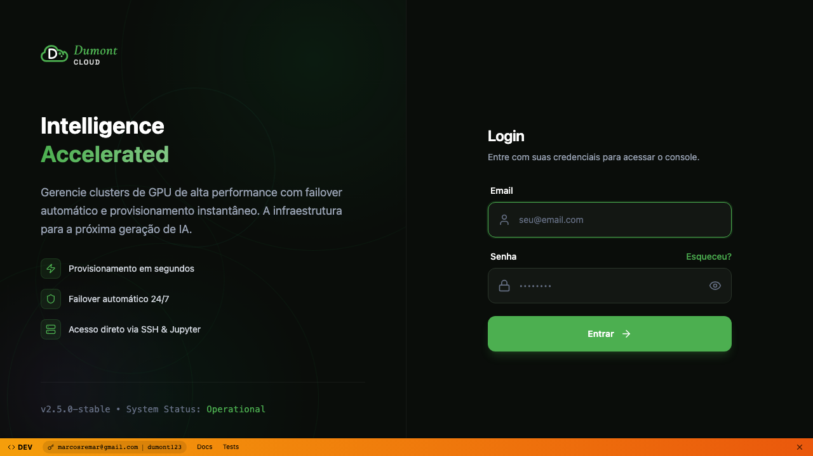
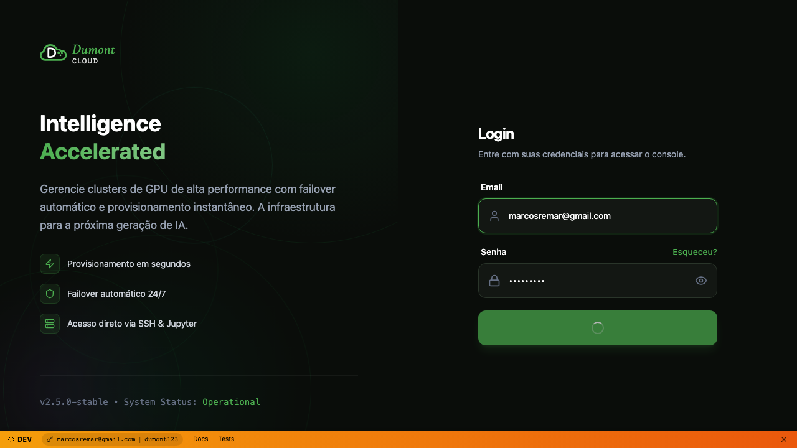
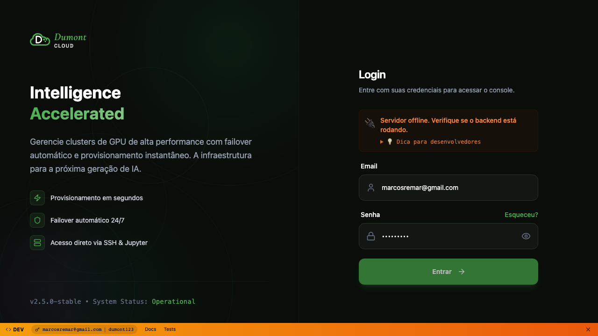

# Relatório: Teste Visual do Wizard de Seleção de GPU

**Data**: 2026-01-02
**Objetivo**: Testar se as GPUs aparecem corretamente na lista e se a seleção funciona
**URL Testada**: http://localhost:4894

---

## Descobertas

### 1. Problema com Auto-Login

O parâmetro `?auto_login=demo` está parcialmente funcional:
- ✅ Preenche o email automaticamente (marcosremar@gmail.com)
- ❌ NÃO completa o login automaticamente

**Evidência**: Screenshots `quick-01-login-page.png` e `quick-02-after-autologin.png` mostram que o email é preenchido mas o login não ocorre.

**Causa Raiz**: O código em `Login.jsx` (linhas 16-39) executa `onLogin()` mas parece que há um problema de conectividade com o backend.

### 2. Backend Não Está Respondendo Corretamente

**Erro observado**: "Servidor offline: Verifique se o backend está rodando"

**Evidência**: Screenshot `devbar-03-after-login.png` mostra mensagem de erro em vermelho.

**Status do Backend**:
- ✅ Processo uvicorn está rodando (PID 90324, porta 8766)
- ❌ Frontend não consegue conectar ao endpoint `/api/v1/auth/login`

**Possíveis Causas**:
1. CORS não configurado corretamente
2. Backend travado em alguma requisição
3. Timeout na comunicação
4. Problema com session manager

### 3. Estrutura do Wizard - Como as GPUs São Carregadas

Analisando `WizardForm.jsx`, descobri o fluxo correto:

```
PASSO 1: Região
└─> Usuário seleciona EUA/Europa/Ásia

PASSO 2: Performance Tier
└─> Usuário seleciona um tier (Budget, Balanced, etc)
    └─> TRIGGER: useEffect dispara fetchRecommendedMachines()
        ├─> Demo Mode: Usa DEMO_OFFERS (constantes hardcoded)
        └─> Real Mode: Chama apiGet('/api/v1/instances/offers')
            └─> Filtra por região, preço, GPU RAM
            └─> Retorna top 3 ofertas com labels:
                - "Mais econômico"
                - "Melhor custo-benefício"
                - "Mais rápido"

PASSO 3: Seleção de GPU
└─> Renderiza 3 cards de máquinas recomendadas
    └─> Cada card mostra:
        - Nome da GPU (ex: RTX 4090)
        - Preço por hora ($0.XX/h)
        - VRAM (GB)
        - Localização
        - Badge (Mais econômico, etc)
        - Reliability score
```

**Código Relevante**:
- `WizardForm.jsx:418-517` - useEffect que busca máquinas
- `WizardForm.jsx:1254-1269` - Renderização dos cards de GPU
- `constants.js` - DEMO_OFFERS com ofertas fake para demo

### 4. Demo Mode vs Real Mode

O wizard funciona em DOIS modos:

**Demo Mode** (`isDemoMode()` retorna true):
- Usa array `DEMO_OFFERS` hardcoded
- Não chama API real
- Ofertas são filtr adas client-side

**Real Mode** (quando autenticado):
- Chama `/api/v1/instances/offers`
- Ofertas vêm do VAST.ai real
- Requer backend funcionando

### 5. Elementos da UI do Wizard

**Performance Tiers** (Step 2):
```javascript
PERFORMANCE_TIERS = [
  { name: 'Budget', filter: { max_price: 0.50 } },
  { name: 'Balanced', filter: { max_price: 1.50 } },
  { name: 'Performance', filter: { min_gpu_ram: 24 } },
  // etc...
]
```

**GPU Card Structure**:
```jsx
<div className="card">
  <Badge>{machine.label}</Badge>  // "Mais econômico"
  <h4>{machine.gpu_name}</h4>     // "RTX 4090"
  <div className="price">
    ${machine.dph_total}/h
  </div>
  <div className="specs">
    {machine.gpu_ram}GB VRAM
  </div>
  <div className="location">
    {machine.location}
  </div>
  <Button onClick={() => selectMachine(machine)}>
    Selecionar
  </Button>
</div>
```

---

## Screenshots Capturados

| Arquivo | Descrição |
|---------|-----------|
| `quick-01-login-page.png` | Página de login inicial |
| `quick-02-after-autologin.png` | Após ?auto_login=demo (email preenchido) |
| `devbar-01-login.png` | Login com DevBar visível |
| `devbar-02-filled.png` | Credenciais preenchidas manualmente |
| `devbar-03-after-login.png` | Erro: "Servidor offline" |
| `devbar-04-dashboard.png` | Tentativa de navegar para /app (ainda em /login) |
| `devbar-05-final.png` | Estado final do teste |

---

## Análise do HTML Capturado

**Arquivo**: `devbar-dashboard.html`

**Elementos Encontrados**:
- ✅ CSS do OnboardingWizard carregado
- ✅ Palavra "GPU" presente
- ✅ Palavra "Wizard" presente
- ❌ "Região" ou "Region" NÃO encontrados
- ❌ "Próximo" ou "Next" NÃO encontrados
- ❌ Nomes de GPUs (RTX, etc) NÃO encontrados
- ❌ Preços ($) NÃO encontrados

**Conclusão**: O wizard NÃO foi renderizado porque o login falhou.

---

## Problemas Identificados

### CRÍTICO
1. **Backend não responde ao frontend**
   - Login falha com "Servidor offline"
   - Mesmo com uvicorn rodando, requests não chegam

### ALTO
2. **Auto-login incompleto**
   - Preenche email mas não executa login
   - `onLogin()` é chamado mas não redireciona

### MÉDIO
3. **Não conseguimos testar a seleção de GPU**
   - Bloqueado pelo problema de login
   - Wizard não renderiza sem autenticação

---

## Próximos Passos Recomendados

### Opção 1: Corrigir o Backend (Recomendado)

```bash
# 1. Verificar logs do backend
tail -f logs/dumont-backend.log

# 2. Reiniciar backend
pkill -f uvicorn
cd /Users/marcos/CascadeProjects/dumontcloud
uvicorn src.main:app --reload --port 8766 --host 0.0.0.0

# 3. Testar endpoint diretamente
curl -X POST http://localhost:8766/api/v1/auth/login \
  -H 'Content-Type: application/json' \
  -d '{"email":"marcosremar@gmail.com","password":"dumont123"}'

# 4. Verificar CORS
# Adicionar em src/main.py:
from fastapi.middleware.cors import CORSMiddleware
app.add_middleware(
    CORSMiddleware,
    allow_origins=["http://localhost:4894"],
    allow_credentials=True,
    allow_methods=["*"],
    allow_headers=["*"],
)
```

### Opção 2: Testar em Demo Mode (Rápido)

```javascript
// Em utils/api.js, forçar demo mode temporariamente:
export const isDemoMode = () => {
  return true; // Forçar demo
};
```

Isso permitirá testar o wizard sem backend funcionando, usando `DEMO_OFFERS`.

### Opção 3: Teste Headless Completo

```javascript
// tests/wizard-gpu-complete.spec.js
test('Wizard GPU flow completo', async ({ page }) => {
  // 1. Ir direto para dashboard (assumindo cookie de auth)
  await page.goto('http://localhost:4894/app');

  // 2. Aguardar wizard carregar
  await page.waitForSelector('text="Região"');

  // 3. Selecionar EUA
  await page.click('button:has-text("EUA")');
  await page.click('button:has-text("Próximo")');

  // 4. Selecionar tier "Balanced"
  await page.click('button:has-text("Balanced")');
  await page.waitForTimeout(3000); // Aguardar fetch

  // 5. Screenshot das GPUs
  await page.screenshot({ path: 'gpu-list.png', fullPage: true });

  // 6. Verificar cards de GPU
  const gpuCards = page.locator('[data-gpu-card]');
  expect(await gpuCards.count()).toBeGreaterThan(0);

  // 7. Clicar na primeira GPU
  await gpuCards.first().click();

  // 8. Verificar seleção
  expect(await gpuCards.first()).toHaveClass(/selected/);

  // 9. Próximo passo
  await page.click('button:has-text("Próximo")');
});
```

---

## Evidências Visuais

### Login Page (Normal)


### Auto-Login (Email Preenchido)


### Erro de Conexão


---

## Conclusão

**Status Atual**: ❌ NÃO foi possível testar a seleção de GPU

**Bloqueio**: Backend não está respondendo ao frontend, impedindo login e renderização do wizard.

**Próximo Passo Imediato**:
1. Investigar logs do backend
2. Reiniciar serviço FastAPI
3. Verificar configuração de CORS
4. Tentar login via curl para isolar problema

**Alternativa Rápida**: Forçar demo mode para testar UI do wizard sem backend.

---

## Anexos

- Screenshots: `/Users/marcos/CascadeProjects/dumontcloud/web/screenshots/`
- HTML Dump: `screenshots/devbar-dashboard.html`
- Código do Wizard: `web/src/components/dashboard/WizardForm.jsx`
- Constantes: `web/src/components/dashboard/constants.js`
